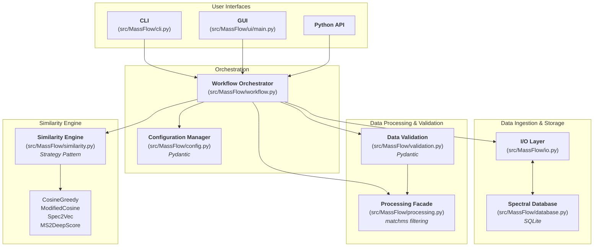
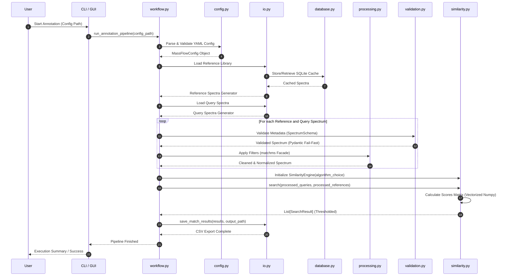

# MassFlow Architecture

## System Overview

MassFlow is a tandem mass spectrometry (MS/MS) data analysis pipeline designed for spectral cleaning, filtering, and similarity searching. The system is built using a modular architecture that emphasizes type safety (via Pydantic), extensibility (via the Strategy Pattern), and robustness (via the Facade Pattern over `matchms`).

The architecture strictly separates I/O side-effects from stateless processing logic, ensuring that the pipeline remains reproducible, testable, and highly stable even when encountering malformed vendor data.

---

## Component Architecture Diagram

This diagram outlines the core modules of MassFlow and their structural relationships.

---

## Annotation Pipeline Data Flow (Sequence Diagram)

This diagram illustrates the sequence of operations and the flow of data when executing a typical annotation run via the CLI or GUI.

---

## Module Responsibilities

### `MassFlow.cli` & `MassFlow.ui`
The entry points for users. The CLI (`cli.py`) handles command-line arguments and logging, while the GUI (`ui/main.py` using `CustomTkinter`) provides an interactive interface for configuring and running the pipeline without touching the terminal. Both ultimately dispatch to the `workflow` module.

### `MassFlow.workflow`
The central orchestrator (`workflow.py`). It manages the lifecycle of a mass spectrometry analysis:
1. Loading and validating the configuration via `config.py`.
2. Ingesting reference and query data via `io.py`.
3. Coordinating processing and validation steps (`processing.py`, `validation.py`).
4. Executing similarity searches (`similarity.py`).
5. Saving final results to disk.

### `MassFlow.config`
Defines the schema for the entire system using Pydantic (`config.py`). It includes custom validators for mass spectrometry parameters (e.g., ensuring non-negative $m/z$ and retention times, algorithm choices) and provides a unified interface for YAML-based configuration.

### `MassFlow.io`
A unified I/O layer (`io.py`) that abstracts the complexity of different spectral formats (MGF, MSP, mzML). It handles both the streaming of input data, automated format conversions (e.g., triggering `msconvert` for vendor formats), and the structured export of results to CSV or other formats.

### `MassFlow.database`
Implements a local SQLite storage backend (`database.py`) for efficient, batched caching and retrieval of massive spectral reference libraries, drastically reducing memory overhead and load times for repeated runs.

### `MassFlow.validation`
A Pydantic-powered validation layer (`validation.py`) that strictly enforces data integrity. It catches and cleans malformed inputs (like string values like "N/A" in numeric fields) early, acting as a fail-fast mechanism before dirty data hits downstream processing and causes silent calculation errors.

### `MassFlow.processing`
Acts as a facade for the `matchms` filtering library (`processing.py`). It implements a strict, sequential cleaning pipeline:
1. **Metadata Cleaning**: Standardization of names, adducts, formulas, and IDs.
2. **Intensity Filtering**: Removal of noise peaks below strict baselines.
3. **Peak Count Filtering**: Ensuring spectra meet minimum quality requirements or restricting to Top-N peaks.
4. **Normalization**: Scaling intensities to a consistent 0.0 to 1.0 range.

### `MassFlow.similarity`
Implements spectral similarity calculations (`similarity.py`) using the **Strategy Design Pattern**. This provides a unified API to swap between multiple backend algorithms at runtime:
*   **CosineGreedy:** Bipartite peak matching heuristic for exact fragment overlaps.
*   **ModifiedCosine:** Mass-shift incorporated peak matching for structurally related analogues.
*   **Spec2Vec / MS2DeepScore:** Advanced machine learning embeddings for contextual structural relationships.

It leverages vectorized `numpy` operations and sparse matrices for efficient math, strictly avoiding standard Python loops for peak iteration to scale to hundreds of thousands of spectral comparisons.