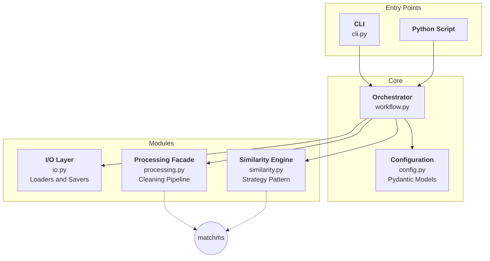

# MassFlow Architecture

## System Overview

MassFlow is a tandem mass spectrometry (MS/MS) data analysis pipeline designed for spectral cleaning, filtering, and similarity searching. The system is built using a modular architecture that emphasizes type safety (via Pydantic), extensibility (via the Strategy Pattern), and robustness (via the Facade Pattern over `matchms`).

## Architecture Diagram

## Module Responsibilities

### `MassFlow.cli`
The entry point for command-line users. It provides commands for running the full pipeline (`process`), cleaning libraries (`clean`), and visualizing spectra (`plot`). It handles argument parsing and basic logging setup.

### `MassFlow.workflow`
The central orchestrator. It manages the lifecycle of a mass spectrometry analysis:
1. Loading and validating configuration.
2. Ingesting reference and query data.
3. Coordinating processing steps.
4. Executing similarity searches.
5. Saving final results.

### `MassFlow.config`
Defines the schema for the entire system using Pydantic. It includes custom validators for mass spectrometry parameters (e.g., ensuring non-negative $m/z$ and retention times) and provides a unified interface for YAML-based configuration.

### `MassFlow.io`
A unified I/O layer that abstracts the complexity of different spectral formats (MGF, MSP, mzML). It handles both the streaming of input data and the structured export of results to CSV or other spectral formats.

### `MassFlow.processing`
Acts as a facade for the `matchms` filtering library. It implements a strict, sequential cleaning pipeline:
1. **Metadata Cleaning**: Standardization of names, adducts, and IDs.
2. **Intensity Filtering**: Removal of noise peaks before normalization.
3. **Peak Count Filtering**: Ensuring spectra meet minimum quality requirements.
4. **Normalization**: Scaling intensities to a consistent range.

### `MassFlow.similarity`
Implements spectral similarity calculations using the **Strategy Design Pattern**. This allows the pipeline to switch between different algorithms (like `Cosine` or `ModifiedCosine`) at runtime without changing the core workflow logic. It is designed to be easily extensible for future algorithms like Spec2Vec or MS2DeepScore.