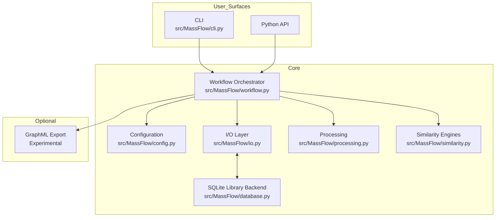
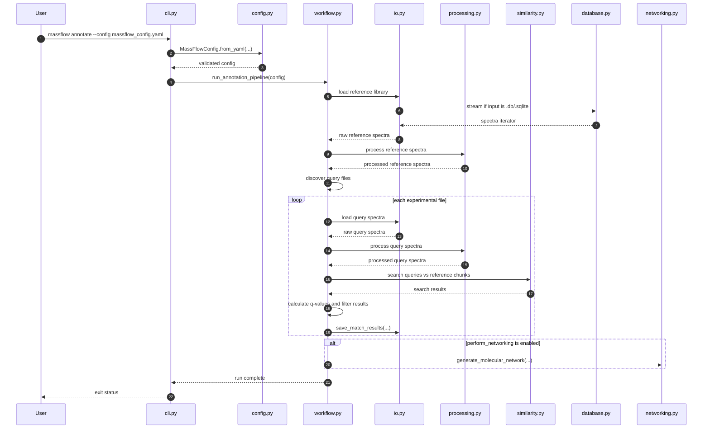

# MassFlow Architecture

## Overview

MassFlow is a local, CLI-first toolkit for tandem mass spectrometry (MS/MS)
annotation workflows.

The core execution path is:

1. load a YAML configuration
2. load an experimental file or directory of files
3. load a reference library
4. process spectra with configurable `matchms` filters
5. run similarity search against the reference library
6. apply score and FDR filtering
7. write per-file CSV result tables

The architecture is intentionally modular. Configuration, I/O, processing,
similarity scoring, database access, and workflow orchestration live in
separate modules so the main annotation path stays predictable and testable.

For `v1.0`, the stable product contract is centered on:

- `massflow annotate --config ...`
- SQLite-backed library workflows through `massflow db`
- open-format ingestion for `mzML`, `mzXML`, `MGF`, and `MSP`
- configurable `matchms`-based processing
- `cosine` and `modified_cosine` similarity
- CSV result export

Experimental utilities such as the terminal browser, molecular networking, and
advanced ML-backed engines remain outside the core support promise.

---

## High-Level Components

### User-facing surfaces

- `src/MassFlow/cli.py`
  - Defines the CLI commands:
    - `annotate`
    - `init`
    - `db build`
    - `db inspect`
    - `db merge`
- Python API
  - Core modules can also be imported directly for scripting or testing.

### Orchestration

- `src/MassFlow/workflow.py`
  - Runs the end-to-end annotation pipeline.
  - Coordinates loading, processing, searching, FDR filtering, and export.
  - Uses multiprocessing to process experimental input files in parallel.

### Configuration

- `src/MassFlow/config.py`
  - Defines the Pydantic models used to validate YAML configuration files.
  - Expands `~` for relevant input paths.
  - Stores processing, similarity, workflow, and export settings.

### Data access

- `src/MassFlow/io.py`
  - Loads spectra from supported open formats and SQLite libraries.
  - Rejects vendor raw formats instead of converting them implicitly.
  - Writes match results to CSV.

- `src/MassFlow/database.py`
  - Stores and retrieves spectra in SQLite format.
  - Supports database build, inspection, and merge workflows.

### Processing

- `src/MassFlow/processing.py`
  - Applies metadata cleaning and peak filtering using `matchms`.
  - Handles operations such as retention-time extraction, intensity filtering,
    minimum peak enforcement, m/z range truncation, Top-N peak reduction, and
    normalization.

### Similarity

- `src/MassFlow/similarity.py`
  - Implements similarity engines and result models.
  - Core engines:
    - `cosine`
    - `modified_cosine`
  - Experimental engines:
    - `spec2vec`
    - `ms2deepscore`
    - `consensus`
    - `cascade`

---

## Component Diagram



---

## Actual Annotation Workflow

The main production path begins with:

- `massflow annotate --config path/to/config.yaml`

The CLI loads the config and calls `run_annotation_pipeline()`.

### Pipeline steps

1. **Configuration loading**
   - The YAML file is parsed into `MassFlowConfig`.
   - Paths such as `file_path`, `data_directory`, and `library_path` have
     `~` expanded.

2. **Library loading**
   - The workflow requires a configured library path.
   - In the preferred config terminology, this is `input.library_path`.
   - The library is loaded first and processed through the configured
     `matchms` pipeline.
   - If no valid spectra are found, the run fails.
   - If the library is small, the workflow logs a warning that FDR estimates
     may be weak.

3. **Experimental input discovery**
   - The workflow accepts either:
     - `input.file_path`
     - or `input.data_directory`
   - If a directory is used, files are discovered recursively.

4. **Per-file multiprocessing**
   - Each experimental input file is processed in a worker process.
   - Each worker builds its own similarity engine instance.

5. **Query spectrum loading and processing**
   - Query spectra are loaded from the experimental file.
   - Each spectrum is passed through metadata and peak processing.
   - Missing query IDs are filled in automatically.

6. **Chunked reference searching**
   - The worker reloads the reference library and processes it again in chunks.
   - Queries are searched against each reference chunk and results are
     aggregated.

7. **FDR calculation**
   - Decoys are generated from the reference spectra.
   - Target and decoy scores are combined to estimate q-values.
   - Final results are filtered by:
     - score thresholds
     - matched-peak thresholds where applicable
     - configured FDR threshold

8. **CSV export**
   - The workflow writes one CSV file per experimental input file.
   - Output filenames follow the pattern:
     - `<input_stem>_results.csv`

9. **Optional networking**
   - If `workflow.perform_networking` is enabled, GraphML output is generated.
   - This path is optional and experimental.

---

## Sequence Diagram



---

## Supported Inputs and Outputs

### Supported direct input formats

MassFlow directly loads:

- `mzML`
- `mzXML`
- `MGF`
- `MSP`
- SQLite libraries:
  - `.db`
  - `.sqlite`

There is also internal support for pickle-based loading in the I/O layer, but
that is not part of the main config-first workflow contract.

### Unsupported direct input formats

MassFlow intentionally does **not** perform vendor raw conversion internally.

Examples of vendor formats that must be converted before use include:

- `.raw`
- `.d`
- `.wiff`
- `.lcd`
- `.t2d`
- `.baf`

Users should convert these to open formats such as `mzML` or `MGF` before
running the annotation workflow.

### Standard outputs

The stable output format is:

- CSV result files written per experimental input

Optional output:

- GraphML molecular-network export when explicitly enabled

Although the config model includes broader export fields, the main annotation
workflow currently writes CSV result tables directly.

---

## Core vs Experimental Features

## Core for the stable annotation workflow

These are the features the docs should treat as the main supported path:

- `massflow annotate --config ...`
- YAML configuration via `MassFlowConfig`
- open-format ingestion for `mzML`, `mzXML`, `MGF`, and `MSP`
- explicit SQLite reference-library workflows
- `matchms`-based metadata and peak processing
- `cosine` and `modified_cosine`
- target-decoy FDR filtering
- per-file CSV result export
- `massflow db build`, `inspect`, and `merge`

## Experimental or less-stable surfaces

These features exist in the repository but should be treated more cautiously:

- `spec2vec`
- `ms2deepscore`
- `consensus`
- `cascade`
- GraphML networking
- pickle-oriented utility paths

See `README.md` for the user-facing guide to what is currently experimental, why it is classified that way, and how to approach those features safely.

---

## Module Responsibilities

### `MassFlow.cli`
Parses command-line arguments, configures logging, and dispatches CLI commands
into the workflow, browser, or database layers.

### `MassFlow.workflow`
Implements the annotation pipeline. It loads and processes the reference
library, discovers input files, processes query spectra in parallel, performs
chunked searching, applies FDR filtering, and writes output CSV files.

### `MassFlow.config`
Defines the nested configuration schema used by the CLI and workflow.
Validation is focused on structural correctness and basic parameter
constraints rather than full runtime guarantees.

### `MassFlow.io`
Provides the file-system boundary for MassFlow. It loads spectra from supported
formats, rejects unsupported vendor raw inputs, and exports result tables.

### `MassFlow.database`
Provides SQLite-backed storage for spectral libraries and helper methods for
build, inspection, merge, and spectrum streaming.

### `MassFlow.processing`
Applies the configured `matchms` metadata repairs and peak filtering pipeline.

### `MassFlow.similarity`
Creates and runs the scoring engines. It also defines decoy generation and
result structures used during FDR calculation.

### `MassFlow.networking`
Builds GraphML molecular-network output from workflow results when networking
is enabled.

---

## Design Principles

MassFlow follows a few simple design rules:

- **Config first:** reproducible CLI runs are preferred over ad hoc scripts.
- **Open formats only:** vendor conversion happens before MassFlow.
- **Small focused modules:** I/O, processing, scoring, and orchestration stay
  separated.
- **Predictable outputs:** the core workflow should either produce CSV results
  or return actionable errors.
- **Experimental boundaries:** advanced engines and interactive utilities may
  evolve without expanding the core support promise.

---

## Practical Example

A typical config-driven run looks like this:

```yaml
project:
  output_directory: "results/standard_analysis"

input:
  file_path: "data/experiments/experiment.mzML"
  library_path: "data/libraries/library.msp"
  format: "mzml"

similarity:
  algorithm: "cosine"
  ms1_tolerance: 10.0
  ms2_tolerance: 0.02
  tolerance_unit: "Da"
  min_score: 0.6
  min_matched_peaks: 3
  fdr_threshold: 0.05
```

Run it with:

```shell
uv run massflow annotate --config massflow_config.yaml
```

This will process the experimental file, search it against the reference
library, and write a CSV file into the configured output directory.
