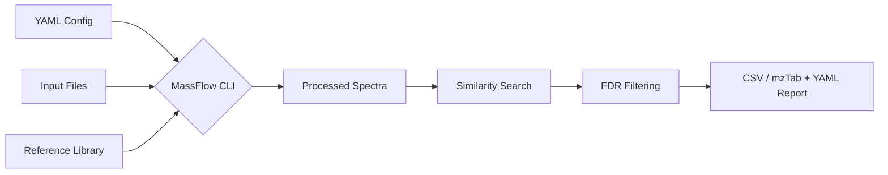
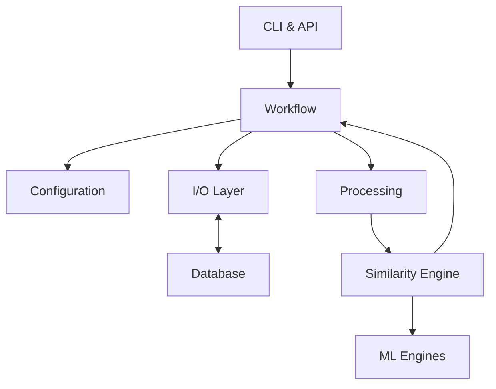
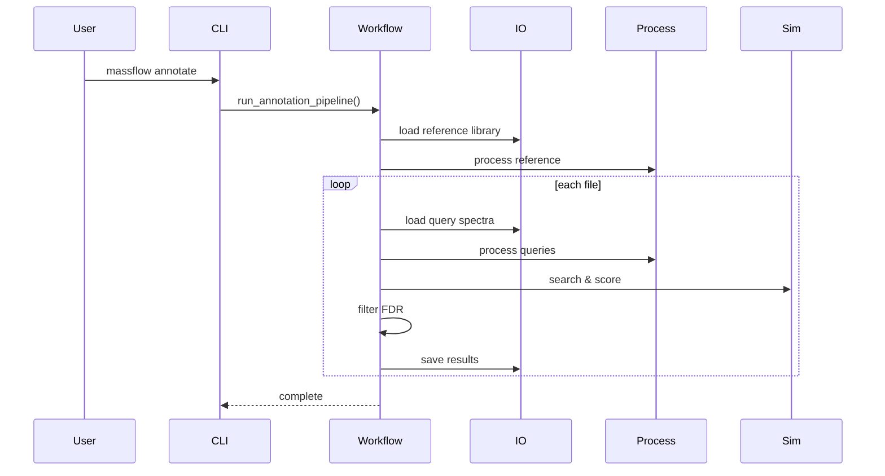

# MassFlow Architecture

## Overview

MassFlow is a local, CLI-first toolkit for tandem mass spectrometry (MS/MS)
annotation workflows.

The core execution path is:

1. load a YAML configuration
2. load an experimental file or directory of files
3. load a reference library
4. process spectra with configurable `matchms` filters
5. run similarity search against the reference library
6. apply score and FDR filtering
7. write per-file CSV result tables

The architecture is intentionally modular. Configuration, I/O, processing,
similarity scoring, database access, and workflow orchestration live in
separate modules so the main annotation path stays predictable and testable.

For `v0.1`, the stable product contract is centered on:

- `massflow tutorial` — generates synthetic tutorial data for local evaluation
- `massflow annotate --config ...`
- SQLite-backed library workflows through `massflow db`
- open-format ingestion for `mzML`, `mzXML`, `MGF`, and `MSP`
- configurable `matchms`-based processing
- `cosine` and `modified_cosine` similarity
- CSV and mzTab-M result export formats

Advanced ML-backed engines and other experimental utilities remain outside the
core support promise.

---

## Simple Data Flow Workflow



---

## High-Level Components

### User-facing surfaces

- `src/MassFlow/cli.py`
  - Defines the CLI commands:
    - `init`
    - `tutorial`
    - `annotate`
    - `convert`
    - `db build`
    - `db inspect`
    - `db merge`
    - `stream-server`
    - `serve`
    - `watch`
- Python API
  - Core modules can also be imported directly for scripting or testing.

### Orchestration

- `src/MassFlow/workflow.py`
  - Runs the end-to-end annotation pipeline.
  - Coordinates loading, processing, searching, FDR filtering, and export.
  - Uses multiprocessing to process experimental input files in parallel.

### Configuration

- `src/MassFlow/config.py`
  - Defines the Pydantic models used to validate YAML configuration files.
  - Expands `~` for relevant input paths.
  - Stores processing, similarity, workflow, and export settings.

### Data access

- `src/MassFlow/io.py`
  - Loads spectra from supported open formats and SQLite libraries.
  - Rejects vendor raw formats instead of converting them implicitly.
  - Writes match results to CSV and mzTab-M formats, and can export spectra
    as MGF or MSP.

- `src/MassFlow/database.py`
  - Stores and retrieves spectra in SQLite format.
  - Supports database build, inspection, and merge workflows.
  - Supports a hybrid storage mode where SQLite retains metadata plus a
    `zarr_ref`/`zarr_index` reference pair and fragment arrays live in a
    chunked Zarr store (see `src/MassFlow/zarr_store.py`), with a migration
    utility (`scripts/migrations/0002_blobs_to_zarr.py`) for existing BLOB
    libraries.
  - Implements a fast NumPy-based **Triage Bitmask** scan during insertion to flag structurally significant features (e.g., Tyrosine immonium ions at 136.076 Da). These flags are stored as JSON in the `triage_flags` column for future ML routing.

### Processing

- `src/MassFlow/processing.py`
  - Applies metadata cleaning and peak filtering using `matchms`.
  - Handles operations such as retention-time extraction, intensity filtering,
    minimum peak enforcement, m/z range truncation, Top-N peak reduction, and
    normalization.

### Similarity

- `src/MassFlow/similarity.py`
  - Implements similarity engines and result models.
  - Core engines:
    - `cosine`
    - `modified_cosine`
  - Experimental engines:
    - `spec2vec`
    - `ms2deepscore`
    - `consensus` (via the `ConsensusEngine`)
    - `cascade`
- `src/MassFlow/acceleration.py`
  - Numba-accelerated peak/neutral-loss matching prefilter that skips
    query-reference pairs below `min_matched_peaks` before exact
    modified-cosine scoring (pure-NumPy fallback with identical results).
- `src/MassFlow/hnsw.py`
  - hnswlib-backed HNSW (Hierarchical Navigable Small World) index over
    two-channel binned spectral vectors (`[binned exact m/z, binned
    neutral losses]`) for sub-linear candidate retrieval on massive
    libraries. The neutral-loss channel preserves recall for shifted
    analogues under modified cosine. Used by the cascade engine as an
    approximate pre-stage; spectral similarity is non-metric, so exact
    scoring always follows.

### Data models and consensus scoring

- `src/MassFlow/models.py`
  - Defines strict Pydantic data contracts (`AnnotationHit`, `ConsensusInput`, `ConsensusResult`, `ConsensusConfig`, `MolecularStructure`).
  - Provides a dependency-free, engine-agnostic language for communication between the lightweight core and heavy ML satellite repositories (e.g., `massflow-ml`).
  - Implements rigorous structural validation (e.g., 5 ppm precursor m/z checks) and automatically calculates theoretical `isotopic_envelope` distributions for valid molecules.
- Consensus *scoring* is provided by the `ConsensusEngine` in `src/MassFlow/similarity.py`, which combines cosine, modified_cosine, and (when the `[ml]` extra is installed) Spec2Vec/MS2DeepScore sub-engines into a weighted consensus score. The standalone `MassFlow.consensus` orchestrator module (the v0.2 Orchestrator API with `generate_consensus`) was removed in the v1.0 engine lockdown; the tie-breaking and credibility-check logic it implemented is no longer part of the codebase.

---

## Scientific Data Integrity

MassFlow enforces strict physical boundaries at the point of ingestion, ensuring that automated annotation pipelines do not propagate chemically impossible results.

### Precursor Validation (5 ppm Tolerance)
Within the `SpectrumMetadata` contract (defined in `MassFlow.models`), an experimental `precursor_mz` is rigorously cross-referenced against the molecule's theoretical exact mass, charge state, and ionization adduct. The theoretical m/z is computed from the exact mass plus the adduct offset — via `MassFlow.cheminformatics.compute_adduct_offset` and its `_ADDUCT_SPECS` registry — divided by the absolute charge. If the experimental precursor m/z deviates from this theoretical value by more than **5.0 ppm**, the record is flagged `is_physically_valid = False` so downstream processing treats it as chemically implausible.

**Supported Adducts:**
- **Positive Mode:** `[M+H]+`, `[M+NH4]+`, `[M+Na]+`, `[M+K]+`, `[M]+`, `[M+2H]2+`
- **Negative Mode:** `[M-H]-`, `[M+Cl]-`, `[M+HCOO]-`, `[M+CH3COO]-`, `[M+FA-H]-` (Formate), `[M]-`

### Theoretical Isotopic Envelopes
For advanced structural verification, the `MolecularStructure` model automatically calculates and caches the theoretical isotopic envelope (M, M+1, M+2, etc.) for any parsed SMILES string. By generating abundance-weighted centroid masses normalized to the base peak, the pipeline establishes a ground-truth MS1 signature for every reference candidate. This allows the `ConsensusEngine` and orthogonal ML models to evaluate candidate credibility by checking experimental MS1 isotopic patterns, providing a powerful orthogonal tie-breaking mechanism when MS2 fragmentation scores are ambiguous.

---

## Component Diagram



---

## Actual Annotation Workflow

The main production path begins with:

- `massflow annotate --config path/to/config.yaml`

The CLI loads the config and calls `run_annotation_pipeline()`.

### Pipeline steps

1. **Configuration loading**
   - The YAML file is parsed into `MassFlowConfig`.
   - Paths such as `input_path` and `library_path` have `~` expanded.

2. **Library loading**
   - The workflow requires a configured library path.
   - In the preferred config terminology, this is `input.library_path`.
   - The library is loaded first and processed through the configured
     `matchms` pipeline.
   - If no valid spectra are found, the run fails.
   - If the library is small, the workflow logs a warning that FDR estimates
     may be weak.

3. **Experimental input discovery**
   - The workflow reads `input.input_path`, which may point to a single
     spectral file or a directory of files.
   - If a directory is used, files are discovered recursively.

4. **Pre-loading and Multiprocessing**
   - The parent process generates the decoy library ONCE.
   - The fully processed reference library and decoys are loaded into shared memory.
   - Each experimental input file is dispatched to a worker process.

5. **Query spectrum loading and processing**
   - Query spectra are loaded from the experimental file.
   - Each spectrum is passed through metadata and peak processing.
   - Missing query IDs are filled in automatically.

6. **Chunked reference searching (Zero I/O overhead)**
   - The worker searches its queries against the pre-loaded shared memory library in chunks to preserve RAM, entirely bypassing disk I/O.
   - Results are aggregated.

7. **FDR calculation**
   - Entropy-based decoys are generated from the reference spectra:
     each decoy preserves the precursor m/z and the Shannon entropy of its
     source's noise-filtered fragment intensities while randomizing the
     fragmentation pathways, avoiding the null-distribution bias of naive
     fragment shuffling.
   - Target and decoy scores are combined to estimate q-values.
   - The workflow logs a target-decoy entropy-divergence diagnostic to
     flag biased FDR calibration.
   - Final results are filtered by:
     - score thresholds
     - matched-peak thresholds where applicable
     - configured FDR threshold

8. **Result Export**
   - The workflow writes one result file per experimental input file.
   - Output filenames follow the pattern:
     - `<input_stem>_results.<ext>`

---

## Sequence Diagram



---

## Supported Inputs and Outputs

### Supported direct input formats

MassFlow directly loads:

- `mzML`
- `mzXML`
- `MGF`
- `MSP`
- SQLite libraries:
  - `.db`
  - `.sqlite`

### Unsupported direct input formats

MassFlow intentionally does **not** perform vendor raw conversion internally.

Examples of vendor formats that must be converted before use include:

- `.raw`
- `.d`
- `.wiff`
- `.lcd`
- `.t2d`
- `.baf`

Users should convert these to open formats such as `mzML` or `MGF` before
running the annotation workflow.

### Standard outputs

The stable output formats are:

- CSV or mzTab-M result files written per experimental input

The export format is selected via `export.format` in the config (supported
values: `csv` or `mztab`).

---

## Core vs Experimental Features

## Core for the stable annotation workflow

These are the features the docs should treat as the main supported path:

- `massflow tutorial` — generates synthetic tutorial data for local evaluation
- `massflow annotate --config ...`
- YAML configuration via `MassFlowConfig`
- open-format ingestion for `mzML`, `mzXML`, `MGF`, and `MSP`
- explicit SQLite reference-library workflows
- `matchms`-based metadata and peak processing
- `cosine` and `modified_cosine`
- target-decoy FDR filtering
- per-file CSV and mzTab-M result export
- `massflow db build`, `inspect`, and `merge`

## Experimental or less-stable surfaces

These features exist in the repository but should be treated more cautiously:

- `spec2vec`
- `ms2deepscore`
- `consensus`
- `cascade`

See `README.md` for the user-facing guide to what is currently experimental, why it is classified that way, and how to approach those features safely.

---

## Module Responsibilities

### `MassFlow.cli`
Parses command-line arguments, configures logging, and dispatches CLI commands
into the workflow or database layers.

### `MassFlow.workflow`
Implements the annotation pipeline. It loads and processes the reference
library, discovers input files, processes query spectra in parallel, performs
chunked searching, applies FDR filtering, and writes output CSV files.

### `MassFlow.config`
Defines the nested configuration schema used by the CLI and workflow.
Validation is focused on structural correctness and basic parameter
constraints rather than full runtime guarantees.

### `MassFlow.io`
Provides the file-system boundary for MassFlow. It loads spectra from supported
formats, rejects unsupported vendor raw inputs, and exports result tables.

### `MassFlow.database`
Provides SQLite-backed storage for spectral libraries and helper methods for
build, inspection, merge, and spectrum streaming. In addition to the default
BLOB mode (``mz_array`` / ``intensity_array``), it supports a hybrid mode
where SQLite retains only metadata plus a ``zarr_ref`` / ``zarr_index``
reference pair and fragment arrays are persisted in a chunked Zarr store
(see ``MassFlow.zarr_store``). The ``migrate_blobs_to_zarr`` helper (wrapped
by ``scripts/migrations/0002_blobs_to_zarr.py``) migrates existing BLOB
libraries to the hybrid backend with bitwise verification.

### `MassFlow.processing`
Applies the configured `matchms` metadata repairs and peak filtering pipeline.

### `MassFlow.similarity`
Creates and runs the scoring engines. It also defines decoy generation and
result structures used during FDR calculation. Modified-cosine scoring uses a
Numba-accelerated peak/neutral-loss prefilter (`MassFlow.acceleration`) to
skip pairs that cannot reach `min_matched_peaks`; the cascade engine can
optionally use a HNSW (Hierarchical Navigable Small World) index
(`MassFlow.hnsw`) for sub-linear candidate retrieval before exact scoring.
External ML engines (Spec2Vec, MS2DeepScore) sit behind the
`MLEngineProtocol` boundary and may run remotely over REST/gRPC
(`MassFlow.ml_client`, `ml_endpoints` in the config); a circuit breaker plus
classical modified_cosine fallbacks in the meta-engines and workflow keep
runs alive when the ML service is unreachable or heavy dependencies are
missing.

### `MassFlow.streaming` (experimental)
Implements the gRPC real-time annotation server (`StreamSpectra` bidirectional
RPC plus `GetStatus` health probe). Incoming packets are validated through a
Pydantic/matchms gate, buffered in a bounded async queue with quality-gated
high-water-mark backpressure (low-quality spectra are shed under overrun and
reported as `spectra_dropped_low_quality`), micro-batched, and routed through
the `ConsensusEngine`; annotations stream back to the client as they complete.

---

## Design Principles

MassFlow follows a few simple design rules:

- **Config first:** reproducible CLI runs are preferred over ad hoc scripts.
- **Open formats only:** vendor conversion happens before MassFlow.
- **Small focused modules:** I/O, processing, scoring, and orchestration stay
  separated.
- **Predictable outputs:** the core workflow should either produce CSV results
  or return actionable errors.
- **Experimental boundaries:** advanced engines and interactive utilities may
  evolve without expanding the core support promise.

---

## Practical Example

A typical config-driven run looks like this:

```yaml
project:
  output_directory: "results/standard_analysis"

input:
  input_path: "data/experiments/experiment.mzML"
  library_path: "data/libraries/library.msp"
  format: "mzml"

similarity:
  algorithm: "cosine"
  ms1_tolerance: 0.02
  ms2_tolerance: 0.02
  tolerance_unit: "Da"
  min_score: 0.6
  min_matched_peaks: 3
  fdr_threshold: 0.05
```

Run it with:

```shell
uv run massflow annotate --config massflow_config.yaml
```

This will process the experimental file, search it against the reference
library, and write a CSV file into the configured output directory.
