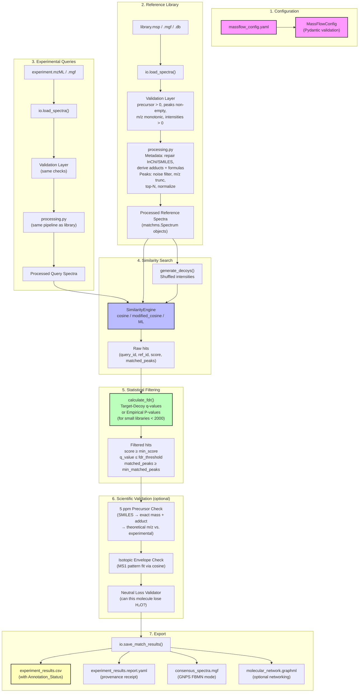

# MassFlow: A Deep Dive into Config-First MS/MS Annotation

> **A personal blog-style exploration of how MassFlow turns raw mass spectra into annotated, publishable results — with zero black boxes.**

---

## The Problem MassFlow Solves

If you work in metabolomics or analytical chemistry, you've lived this nightmare: you have a folder of `.mzML` files from your Q-TOF, a 10 GB reference library in `.msp` format, and you need to figure out *what compounds are in your samples*. The standard approach is a patchwork of ad-hoc Python scripts, R packages, and manual Excel wrangling — fragile, unreproducible, and painful to revisit six months later when a reviewer asks how you set your noise threshold.

MassFlow says: **put it all in one YAML file, and run one command.**

```bash
uv run massflow annotate --config massflow_config.yaml
```

That single command does everything: loads your experimental spectra, cleans the metadata, filters noise peaks, searches against a reference library, estimates statistical confidence (FDR), and exports a clean CSV you can open in Excel. And it spits out a YAML "receipt" alongside every result file so you can **prove** exactly what settings produced that data.

---

## Architecture at a Glance

MassFlow is a modular Python toolkit (3.13+) built on `matchms`, `Pydantic`, `NumPy`, and `Polars`. The architecture follows a clean pipeline pattern — each module has one job:

| Module | Responsibility |
|---|---|
| `config.py` | Pydantic models that validate your YAML config (tolerances, thresholds, paths) before **anything** runs |
| `io.py` | File-system boundary: loads `.mzML`, `.mzXML`, `.MGF`, `.MSP`, `.db`; quarantines malformed spectra |
| `processing.py` | Two-stage pipeline: metadata repair (InChI, adducts, formulas) → peak filtering (noise, m/z truncation, top-N) |
| `similarity.py` | Scoring engines: `cosine`, `modified_cosine` (stable); `spec2vec`, `ms2deepscore`, `consensus`, `cascade` (experimental) |
| `database.py` | SQLite persistence: build, inspect, merge spectral libraries; `float64` BLOB storage for peak arrays |
| `workflow.py` | Orchestrator: multiprocessing, chunked reference searching, FDR calculation, export dispatch |
| `consensus.py` | Multi-engine vote aggregation with tie-breaking and scientific credibility checks |
| `models.py` | Pydantic data contracts for the Orchestrator API (5 ppm validation, isotopic envelopes) |
| `cheminformatics.py` | RDKit + pyteomics bridge for exact mass, isotopic distributions, neutral loss detection |
| `cli.py` | Click-based CLI: `annotate`, `init`, `watch`, `convert`, `db {build,inspect,merge}`, `visualize` |

---

## The Full Information Flow



---

## Key Design Decisions Worth Understanding

### 1. Config-First, Always Reproducible

MassFlow is opinionated: you don't pass flags on the command line for scientific parameters. Everything — file paths, noise thresholds, mass tolerances, FDR cutoffs — lives in one YAML file. This means:

- Your colleague can clone your repo, run the same command, and get **identical results**.
- The `.report.yaml` sidecar acts as a cryptographic receipt: it captures the exact config, timestamps, and file paths used.
- The Pydantic validation fails **before** any heavy computation starts — if your `min_score` is 1.5 (physically impossible), you'll know immediately with a line-numbered error message.

### 2. Strict 5 ppm Precursor Mass Validation

This is MassFlow's scientific integrity anchor. When a reference spectrum has a SMILES string, the pipeline:

1. Computes the **exact monoisotopic mass** via RDKit
2. Adds the **adduct offset** (e.g., `[M+H]+` = +1.007276 Da) from a high-precision internal registry
3. Divides by the absolute charge state
4. Compares to the experimental `precursor_mz`

If the deviation exceeds **5.0 ppm**, the match is flagged as physically invalid. This catches library errors (wrong SMILES, mislabeled adducts) that would silently produce garbage results in most pipelines.

Supported adducts include all the common LC-MS suspects: `[M+H]+`, `[M+Na]+`, `[M+NH4]+`, `[M+K]+`, `[M-H]-`, `[M+Cl]-`, `[M+HCOO]-`, `[M+CH3COO]-`, and even radical species like `[M]+` and `[M]-`.

### 3. SQLite Library Compression — The "No More 10 GB RAM Crashes" Feature

Loading a massive `.msp` file (like the full GNPS library at several GB) into memory every time you run an annotation is a recipe for crashes. MassFlow solves this with a pre-processing step:

```bash
uv run massflow db build \
    --input libraries/ALL_GNPS.msp \
    --output libraries/gnps_reference.db \
    --config massflow_config.yaml \
    --category "public-gnps"
```

This:
- Runs the same cleaning pipeline once and stores the result
- Serializes peak arrays as **binary `float64` BLOBs** (not slow-to-parse text)
- Enables streaming queries from disk instead of materializing everything in RAM
- Adds a `triage_flags` column — a fast NumPy scan during insertion detects diagnostic fragments (like the Tyrosine immonium ion at 136.076 Da) and bitmasks them for future ML routing
- Lets you merge multiple libraries: `massflow db merge --inputs lib1.db lib2.db --output master.db`

### 4. False Discovery Rate: Honest About Statistics

MassFlow doesn't just spit out similarity scores and call it a day. It:

- **Generates decoy spectra** by shuffling fragment intensities (breaking structural correlations while preserving peak count and m/z distribution)
- Scores queries against **both** targets and decoys
- Estimates **q-values** using the conservative +1 pseudocount formula

For large libraries (≥2000 spectra), standard Target-Decoy FDR works well. But MassFlow is honest about small libraries: if your reference set has fewer than 2000 spectra, it logs a **CRITICAL SCIENTIFIC WARNING** explaining that the null distribution is underpowered and recommends relaxing your `fdr_threshold` to 1.0 (relying purely on `min_score` and `min_matched_peaks`).

### 5. The Processing Pipeline: Metadata → Peaks, In That Order

Every spectrum — whether from the reference library or your experimental file — goes through the **exact same pipeline**:

**Metadata Phase:**
- `default_filters`: normalizes keys, strips whitespace
- `repair_inchi_inchikey_smiles`: fixes broken structural identifiers
- `derive_adduct_from_name` / `derive_formula_from_name`: extracts chemical info from compound names
- `make_charge_int` / `derive_ionmode`: ensures consistent charge state

**Peak Phase:**
- `select_by_intensity`: removes peaks below `noise_threshold`
- `require_minimum_number_of_peaks`: drops spectra with fewer than `min_peaks` (prevents noise-only spectra from consuming CPU)
- `select_by_mz`: truncates peaks outside `[mz_min, mz_max]`
- `reduce_to_number_of_peaks`: keeps only the top-N most intense peaks
- `normalize_intensities`: scales so the base peak = 1.0

The pipeline is designed to **fail fast**: if a spectrum becomes empty after noise filtering, it's silently dropped rather than passed to the scoring engine with empty arrays.

### 6. Stable vs. Experimental: A Clear Contract

MassFlow v1.0 draws a bright line between what's production-ready and what's under development:

| **Stable (v1.0)** | **Experimental** |
|---|---|
| `cosine`, `modified_cosine` | `spec2vec`, `ms2deepscore` |
| CSV, mzTab-M, FBMN export | JSON, Excel, Parquet export |
| SQLite library workflows | GraphML molecular networking |
| 5 ppm precursor validation | `ConsensusEngine` / `CascadeEngine` |
| `massflow annotate --config` | `massflow watch` (interactive mode) |
| `massflow db {build,inspect,merge}` | Language Server Protocol (IDE integration) |

This isn't just documentation — the code itself routes differently. `CascadeEngine`, for example, is decorated with `pytest.mark.experimental` throughout the test suite.

---

## The Similarity Engines: How Matching Actually Works

### Cosine (The Workhorse)

The classic algorithm. It computes the normalized dot product of aligned fragment peaks between your query and each reference spectrum. The precursor m/z of both must match within `ms1_tolerance` (default: 0.02 Da). Peaks are aligned greedily within `ms2_tolerance`.

**When to use:** Comparing identical compounds (e.g., authenticating a known standard). Fast, deterministic, well-understood.

### Modified Cosine (The Analog Finder)

Extends cosine scoring by allowing for **mass shifts** between query and reference. If your query has a precursor at 365.217 Da and the reference is at 363.217 Da, modified cosine computes ΔM = +2.000 Da and shifts the reference fragments by that amount before matching. This catches structural analogs — hydroxylated, methylated, or otherwise modified versions of known compounds.

**When to use:** Finding derivatives, metabolites, or degradation products. This is the foundation of molecular networking.

### Cosine vs. Modified Cosine — Visualized

```
Standard Cosine (fails on shifted analog):
Query:  precursor=365.217  fragments=[123.065, 201.102, 303.145]
Ref:    precursor=363.217  fragments=[121.065, 199.102, 301.145]
        123 ≠ 121 → MISS    201 ≠ 199 → MISS    303 ≠ 301 → MISS

Modified Cosine (succeeds):
ΔM = +2.000 Da
Ref shifted: fragments=[123.065, 201.102, 303.145]
        123 = 123 → MATCH    201 = 201 → MATCH    303 = 303 → MATCH
```

---

## The Orchestrator API: A Peek at v1.1

MassFlow has laid the groundwork for a multi-engine consensus system. The `ConsensusEngine` can aggregate results from multiple scoring algorithms (e.g., run `cosine` AND `ms2deepscore` on the same query, then vote):

- Each engine contributes a weighted score based on its known precision-recall characteristics
- If two candidates tie on consensus score, configurable tie-breakers kick in (`highest_rank`, `average_score`, or trust a specific `validator_engine`)
- **Scientific credibility checks** flag cases where engines violently disagree (e.g., Engine A ranks Caffeine #1, Engine B ranks it #500) — these get marked `flagged_for_review` for manual expert inspection
- The `CascadeEngine` uses a two-tier routing strategy: cheap `cosine` first, then route only "gray zone" queries (scores between `cascade_lower_bound` and `cascade_upper_bound`) to the expensive ML model — saving GPU cycles

---

## The I/O Quarantine Layer

One under-appreciated feature: MassFlow doesn't silently swallow bad data. During `io.load_spectra()`, every spectrum passes through a validation checkpoint:

1. `precursor_mz` must exist, be numeric, and be positive
2. Peak arrays must be non-empty
3. `mz_array` and `intensity_array` must have matching lengths
4. All intensities must be positive
5. `mz_array` must be monotonically increasing

Failing spectra are **quarantined** — logged to `massflow_quarantine.log` with the specific reason and their scan ID — and excluded from downstream processing. But they don't crash the pipeline. This means you can throw a messy MGF file at MassFlow and it will extract every valid spectrum while documenting exactly what was wrong with the rest.

---

## CLI Commands Cheat Sheet

```bash
# Initialize a config template
uv run massflow init --output massflow_config.yaml

# Run a full annotation
uv run massflow annotate --config massflow_config.yaml

# Interactive mode (re-runs on file changes)
uv run massflow watch --config massflow_config.yaml

# Convert vendor raw files to mzML
uv run massflow convert --input data/raw/ --output data/mzml/

# Build a SQLite reference library
uv run massflow db build --input library.msp --output library.db --config massflow_config.yaml --category "standards"

# Inspect a database
uv run massflow db inspect library.db

# Merge databases
uv run massflow db merge --inputs db1.db db2.db --output master.db

# Visualize a molecular network
uv run massflow visualize network.graphml --output network.html
```

---

## What Your Results Look Like

After a run, you get a CSV like this:

| query_id | query_precursor_mz | reference_id | reference_name | score | matched_peaks | Annotation_Status |
|---|---|---|---|---|---|---|
| query_0 | 195.0 | ref_12 | Caffeine | 0.98 | 5 | Matched |
| query_1 | 304.0 | | | | | Unknown |
| query_2 | 150.0 | ref_8 | Unknown_Metabolite | 0.75 | 3 | Putative |

And a YAML provenance report:

```yaml
report_created_at: "2026-06-02T12:00:00+00:00"
query_file: "data/experiments/experiment.mzML"
library_path: "data/libraries/library.msp"
results_csv: "results/experiment_results.csv"
config_path: "massflow_config.yaml"
processing:
  clean_metadata: true
  noise_threshold: 1000.0
  min_peaks: 5
similarity:
  algorithm: "cosine"
  ms1_tolerance: 0.02
  ms2_tolerance: 0.02
  min_score: 0.6
  fdr_threshold: 0.05
query_count: 150
retained_count: 42
```

---

## Scientific Guardrails Summary

| Guardrail | What It Does | Why It Matters |
|---|---|---|
| 5 ppm precursor check | Validates experimental m/z against SMILES-derived exact mass + adduct | Prevents "lucky" MS2 matches when the parent mass is physically impossible |
| Isotopic envelope verification | Compares experimental MS1 isotopic pattern to theoretical (RDKit + pyteomics) | Orthogonal evidence beyond fragmentation alone |
| Neutral loss validator | Checks if observed neutral losses (H₂O, NH₃, CO₂, etc.) require atoms absent from the molecular formula | Catches structurally impossible fragmentation assignments |
| Array monotonicity | Rejects spectra with out-of-order m/z values | Malformed vendor exports are caught early |
| Float64 precision | All m/z and intensity arrays stay at double precision | No rounding errors in ppm calculations at high resolution |
| NaN for missing values | Missing scientific data uses NaN, not 0 | 0 is a physically meaningful value in mass spectrometry |

---

## Test Coverage & Quality

- **213 tests**, 212 passing, **80%+ code coverage** enforced in CI
- Tests cover: end-to-end MVP, scientific boundaries (5 ppm edge cases, halogenated isotopes, radical species), FDR edge cases, database migrations, consensus logic, CLI dispatch, I/O quarantine, processing pipeline, similarity engines
- CI pipeline: lint (Ruff) → typecheck (MyPy) → smoke test (tutorial quickstart) → full test suite with coverage
- A "ground truth anchor" test (`test_ground_truth_anchor.py`) freezes consensus results against a known dataset to catch scientific regressions

---

## The Bottom Line

MassFlow is a refreshingly honest piece of scientific software. It doesn't try to be everything — the v1.0 contract is deliberately narrow: classical cosine scoring, open formats, SQLite persistence, CSV exports. But everything it does, it does with rigorous attention to physical correctness and reproducibility. The 5 ppm check alone catches errors that would silently poison results in less careful pipelines.

If you're a metabolomics researcher tired of ad-hoc scripts, MassFlow gives you a single YAML file, a single command, and a paper-ready audit trail. That's the whole pitch.

---

*Written after reading the full MassFlow v1.0 source tree (repomix output), June 2026.*
