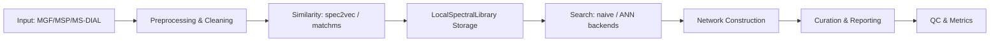

# MassFlow

**A Config-First Analytical Pipeline for High-Throughput Metabolomics**

MassFlow is a Python-based processing engine designed to streamline LC-MS data analysis. Built for reproducibility and scalability, it bridges the gap between raw mass spectrometry data and actionable chemical insights.

Unlike GUI-based tools that obscure processing parameters, MassFlow is driven by a transparent YAML configuration, ensuring every analysis is version-controlled and reproducible. It leverages the **matchms** ecosystem to orchestrate spectral ingestion, cleaning, library matching, and network construction without the need for ad-hoc scripts.

## Key Features

* **YAML-Driven Workflow:** Define your entire processing logic (tolerances, thresholds, steps) in a single human-readable file.
* **Modular Architecture:** Isolate peak picking, alignment, and identification steps for easier debugging and custom extensions.
* **High-Performance I/O:** Optimized reading of standard MS formats (.mzML, .mzXML) with low memory overhead.
* **Automated Reporting:** Generates clean, structured output files ready for downstream statistical analysis (Pandas/R).

---

## Workflow Diagram 🌐



---

## Quick Start

1. Installation

```bash
pip install .
```

1. Configure Your Run

Copy the example_config.yaml and adjust parameters for your instrument. This adheres to the "Config-First" philosophy—parameters live with the data, not the code.

```yaml
processing:
  ms1_tolerance: 10.0  # ppm
  ms2_tolerance: 0.02  # Da
workflow:
  perform_peak_picking: True
  perform_networking: False
```

1. Execute Pipeline

```bash
massflow run --config my_experiment.yaml
```

---

## Technical Architecture

MassFlow is designed with composability in mind. The codebase is structured to allow small, testable components to be recombined.

Core Components 🔎

CLI / Entrypoints: MassFlow/cli.py — Top‑level commands and argument mapping.

Orchestration: MassFlow/workflow.py — Executes the pipeline defined by the config.

Configuration: MassFlow/config.py — Schema validation + dotted ConfigError handling.

Similarity & Storage:

MassFlow/similarity/library.py — LocalSpectralLibrary (JSON/SQLite storage).

MassFlow/similarity/backends.py — Search backends (naive, annoy, faiss placeholders).

Networking: MassFlow/networking/* — Building and exporting similarity networks (GraphML).

Design Philosophy

* Config‑First: Reproducible workflows are declared as YAML. We prefer changing configs over writing ad‑hoc scripts.
* Practical ML/AI: We use learned representations (spec2vec via matchms) where they provide clear gains, but maintain non‑ML fallbacks (Cosine) for validation and debugging.
* Lightweight, Local-First: Tools are optimized to build and search local spectral libraries, suitable for iterative development behind corporate firewalls.

---

## Roadmap

MassFlow is under active development to support advanced lead optimization workflows.

v0.1.0 (Current): Core processing pipeline, peak alignment, and CSV export.

v0.2.0 (Coming Soon): Molecular Networking & GraphML Export for structural similarity analysis.

v0.3.0 (Planned): Direct integration with external spectral libraries (GNPS/MassBank).

---

## License

MIT License

---

### ⚠️ Internal Development Rules (AI Assistants)

Source of Truth: All core logic resides in MassFlow/ (formerly original_source/).

No Restructuring: Do not archive, move, or 'splinter' code without explicit user approval.

Simplification: If asked to simplify, focus on removing unused dependencies, NOT deleting functional business logic.

No Refactoring: Do not refactor code without explicit user approval.
