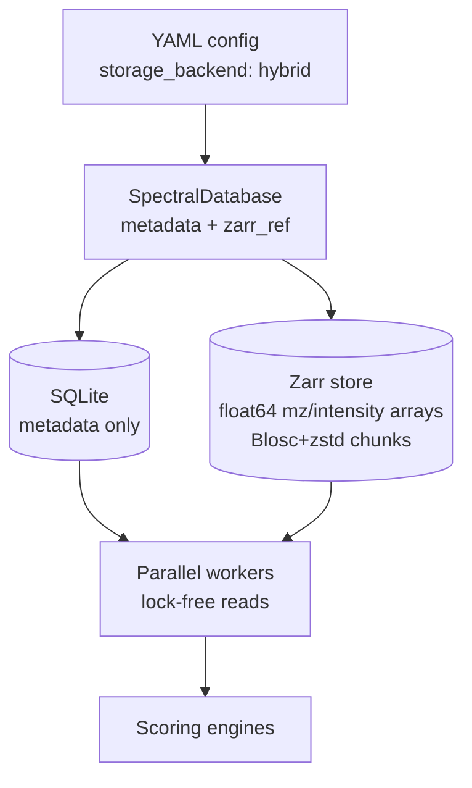
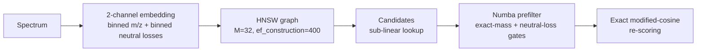
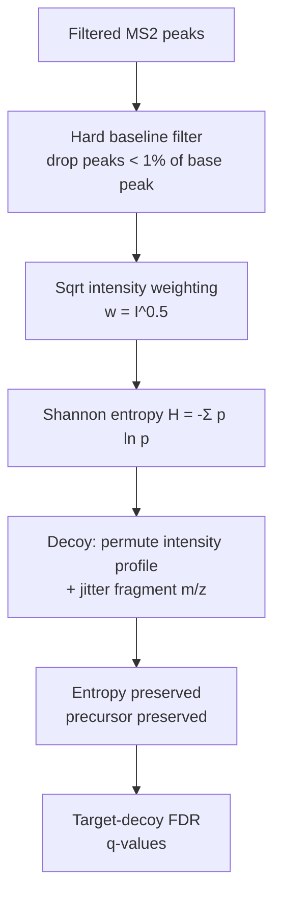
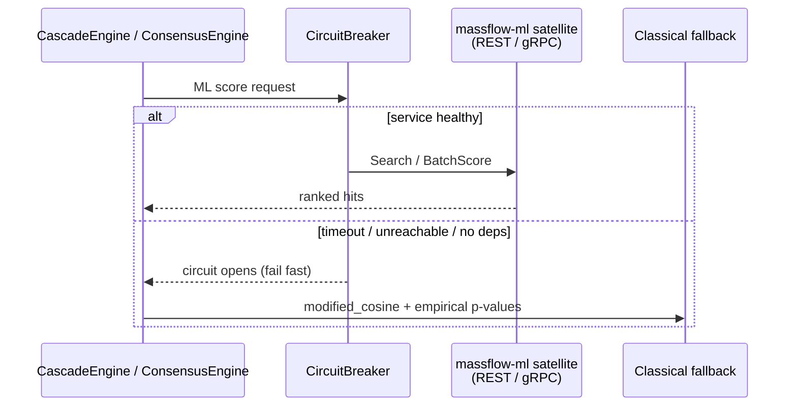
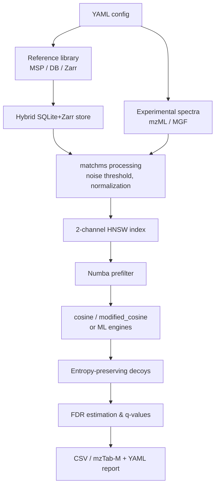

# MassFlow

[](https://github.com/janusson/MassFlow/actions/workflows/ci.yml)
[](https://ericjanusson.github.io/MassFlow/)
[](https://www.python.org/downloads/)
[](LICENSE)

*MassFlow is actively maintained. For inquiries regarding collaborative development, data annotation consulting, or full-time remote opportunities in cheminformatics, please contact Dr. Eric Janusson by email at [ericjanusson@outlook.com](ericjanusson@outlook.com) or by visiting [https://ericjanusson.ca/contact/](https://ericjanusson.ca/contact/).*

**MassFlow is a local-first, high-throughput tandem mass spectrometry (MS/MS)
annotation engine.** It turns experimental spectra (`.mzML`, `.mgf`) and
reference libraries (`.msp`, SQLite/Zarr databases) into calibrated structural
annotations — reproducible, configuration-driven, and fast enough for
all-vs-all molecular networking at scale.

Built on four engineering pillars:

1. **Hybrid Zarr storage** — metadata in SQLite, float64 peak arrays in
   compressed, chunked Zarr. Lock-free concurrent reads, no BLOB I/O
   bottleneck.
2. **Two-channel HNSW indexing** — sub-linear analogue discovery. Spectra are
   embedded as `[binned m/z, binned neutral losses]`, so modified-cosine
   matches survive even when analogue precursors shift.
3. **Entropy-preserving FDR** — decoys preserve precursor m/z *and* the
   spectral information content (√I-weighted Shannon entropy after a strict
   base-peak noise filter), keeping target-decoy calibration honest.
4. **Fail-safe ML microservice boundary** — Spec2Vec/MS2DeepScore run behind
   a remote REST/gRPC contract with a circuit breaker; the core never
   hard-depends on PyTorch or Gensim and always falls back to classical
   scoring.

```shell
# One-liner to generate tutorial data, build the database, and run annotation
uv run massflow tutorial

# Then follow the printed commands to build the DB and annotate
uv run massflow db build --input tutorial/tutorial_library.msp \
    --output tutorial/results/compiled_library.db \
    --config tutorial/tutorial_config.yaml --category library
uv run massflow annotate --config tutorial/tutorial_config.yaml
```

---

## Performance architecture

### 1 · Hybrid SQLite + Zarr storage engine

Fragment arrays were moved out of SQLite BLOBs into compressed, chunked Zarr
stores. The SQLite database keeps only metadata plus a `zarr_ref`/`zarr_index`
reference to each array — reads become lock-free, which removes the
contention point for multiprocessing workers.


```mermaid
flowchart TD
    Config[YAML config<br/>storage_backend: hybrid] --> Write[SpectralDatabase<br/>metadata + zarr_ref]
    Write --> DB[(SQLite<br/>metadata only)]
    Write --> Z[(Zarr store<br/>float64 mz/intensity arrays<br/>Blosc+zstd chunks)]
    DB --> Read[Parallel workers<br/>lock-free reads]
    Z --> Read
    Read --> Score[Scoring engines]
```

- Chunk sizes are tuned: ~1M float64 elements (~8 MB) per peak-array chunk
  balances compression ratio against read amplification; metadata arrays
  chunk at 4096 spectra. An experimental tensor layout `(2, B, M)` maps
  chunks directly onto batch-similarity reads.
- The migration utility
  [`scripts/migrations/0002_blobs_to_zarr.py`](scripts/migrations/0002_blobs_to_zarr.py)
  converts existing BLOB databases: it is bit-for-bit verified, idempotent,
  and interrupt-safe.
- `input.storage_backend: sqlite | zarr | hybrid` selects the layout per run;
  hybrid databases are created with `massflow db build`/`db merge`.

### 2 · Two-channel HNSW index for sub-linear analogue networking

All-vs-all molecular networking scales quadratically. MassFlow embeds every
spectrum into a two-channel vector — `[binned m/z, binned neutral losses]` —
and searches an HNSW graph over that space. The neutral-loss channel
(`precursor_mz − fragment_mz`) is what keeps structural analogues
discoverable when their precursor masses shift.


```mermaid
flowchart LR
    S[Spectrum] --> E[2-channel embedding<br/>binned m/z + binned neutral losses]
    E --> H[HNSW graph<br/>M=32, ef_construction=400]
    H --> C[Candidates<br/>sub-linear lookup]
    C --> P[Numba prefilter<br/>exact-mass + neutral-loss gates]
    P --> R[Exact modified-cosine<br/>re-scoring]
```

- Cosine over binned vectors is **not a metric** (triangle inequality does
  not hold), so the HNSW stage is a *candidate generator only*: every hit is
  re-scored exactly. Construction parameters are exposed for tuning —
  `hnsw_m`, `hnsw_ef_construction`, `hnsw_ef_search`,
  `hnsw_candidates_per_query`, `hnsw_bin_width`, `hnsw_mz_min`,
  `hnsw_mz_max`, `hnsw_random_seed` under `similarity:`. Conservative values
  protect recall in the non-metric regime.
- The index integrates seamlessly into `CascadeEngine` as the first,
  coarse-and-fast stage; [`MassFlow.acceleration`](src/MassFlow/acceleration.py)
  adds Numba-JIT two-pointer prefiltering (with a numerically identical pure
  NumPy fallback) on top.

### 3 · Entropy-preserving decoys & calibrated FDR

Naive fragment shuffling biases the target-decoy null distribution. MassFlow
replaces it with entropy-based decoy generation: each decoy preserves the
precursor m/z and the spectral entropy of its source while randomizing the
fragmentation pathways.


```mermaid
flowchart TD
    P[Filtered MS2 peaks] --> F[Hard baseline filter<br/>drop peaks < 1% of base peak]
    F --> W[Sqrt intensity weighting<br/>w = I^0.5]
    W --> H[Shannon entropy H = -Σ p ln p]
    H --> D[Decoy: permute intensity profile<br/>+ jitter fragment m/z]
    D --> K[Entropy preserved<br/>precursor preserved]
    K --> Q[Target-decoy FDR<br/>q-values]
```

- `MassFlow.similarity.spectral_entropy` applies the spectral-entropy
  weighting (`I^0.5`) and the hard `<1% base-peak` noise filter *before*
  computing information content, so low-abundance chemical noise cannot
  inflate entropy and skew calibration (Li et al., *Nat. Methods* 2021).
- `processing.decoy_min_relative_intensity` and `processing.decoy_mz_shift_da`
  expose the filter and jitter controls; `compare_target_decoy_entropy`
  provides a drift diagnostic that logs a calibration warning whenever
  target and decoy entropy distributions systematically diverge.

### 4 · Fail-safe ML microservice boundary

Heavy scoring engines (Spec2Vec, MS2DeepScore) live outside the core.
The wire contract is `protos/massflow/v1/ml.proto` — served over REST (JSON
mirror) or gRPC — and every remote call is wrapped in a circuit breaker.


```mermaid
sequenceDiagram
    participant O as CascadeEngine / ConsensusEngine
    participant CB as CircuitBreaker
    participant ML as massflow-ml satellite<br/>(REST / gRPC)
    participant C as Classical fallback
    O->>CB: ML score request
    alt service healthy
        CB->>ML: Search / BatchScore
        ML-->>O: ranked hits
    else timeout / unreachable / no deps
        CB-->>O: circuit opens (fail fast)
        O->>C: modified_cosine + empirical p-values
    end
```

- Configure endpoints per algorithm under `similarity.ml_endpoints`
  (e.g. `spec2vec: http://ml-host:8080/spec2vec`,
  `ms2deepscore: grpc://ml-host:9090`), with
  `ml_request_timeout_seconds`, `ml_circuit_breaker_threshold`, and
  `ml_circuit_breaker_cooldown_seconds`.
- If the service is down — or PyTorch/Gensim simply are not installed — the
  pipeline logs a warning and falls back to classical scoring with empirical
  p-values. A run never crashes on ML unavailability.
- A complete reference server (FastAPI REST + `grpc.aio` + dummy model +
  end-to-end smoke client) lives in
  [`examples/massflow-ml-satellite/`](examples/massflow-ml-satellite/).

### 5 · Real-time streaming with backpressure

`massflow stream-server` serves the bidirectional `StreamSpectra` gRPC RPC
for live instrument annotation. A bounded asyncio queue absorbs bursts; when
the buffer exceeds its high-water mark, low-quality spectra are shed and
reported through `GetStatus` (`spectra_dropped`) instead of letting memory
bloat.

---

## Pipeline at a glance


```mermaid
graph TD
    Config[YAML config] --> Ref[Reference library<br/>MSP / DB / Zarr]
    Config --> Exp[Experimental spectra<br/>mzML / MGF]
    Ref --> Store[Hybrid SQLite+Zarr store]
    Store --> Process[matchms processing<br/>noise threshold, normalization]
    Exp --> Process
    Process --> Index[2-channel HNSW index]
    Index --> Pre[Numba prefilter]
    Pre --> Score[cosine / modified_cosine<br/>or ML engines]
    Score --> Decoy[Entropy-preserving decoys]
    Decoy --> FDR[FDR estimation & q-values]
    FDR --> Out[CSV / mzTab-M + YAML report]
```

## Installation

MassFlow requires **Python 3.13+** and uses `uv` for reproducible
environments:

```shell
git clone https://github.com/janusson/MassFlow && cd MassFlow
uv python pin 3.13 && uv sync

# Optional extras
uv sync --extra zarr --extra hnsw   # Zarr storage + HNSW indexing
uv sync --extra ml                  # Spec2Vec / MS2DeepScore (heavy)
```

## Quickstart

```shell
# Generate a synthetic dataset and pre-configured YAML
uv run massflow tutorial

# Build a reusable reference database
uv run massflow db build --input tutorial/tutorial_library.msp \
    --output tutorial/results/compiled_library.db \
    --config tutorial/tutorial_config.yaml --category library

# Annotate
uv run massflow annotate --config tutorial/tutorial_config.yaml
```

A minimal config:

```yaml
project:
  name: "Standard_Annotation_Project"
  output_directory: "results/standard_analysis"

input:
  input_path: "data/experiments/experiment.mzML"
  library_path: "data/libraries/library.msp"
  format: "mzml"
  storage_backend: "hybrid"        # sqlite | zarr | hybrid

processing:
  clean_metadata: true
  noise_threshold: 1000.0
  min_peaks: 5
  decoy_min_relative_intensity: 0.01   # 1% base-peak noise floor for FDR
  decoy_mz_shift_da: 1.0

similarity:
  algorithm: "modified_cosine"
  ms1_tolerance: 0.02
  ms2_tolerance: 0.02
  min_score: 0.6
  min_matched_peaks: 3
  fdr_threshold: 0.01

  # --- HNSW candidate pre-stage (sub-linear search) ---
  hnsw_enabled: true
  hnsw_m: 32
  hnsw_ef_construction: 400
  hnsw_ef_search: 200
  hnsw_candidates_per_query: 200
  hnsw_bin_width: 1.0
  hnsw_mz_min: 0.0
  hnsw_mz_max: 2000.0

  # --- Remote ML engines (optional; classical fallback is automatic) ---
  ml_endpoints:
    spec2vec: "http://localhost:8080/spec2vec"
    ms2deepscore: "grpc://localhost:9090"
  ml_request_timeout_seconds: 10.0
  ml_circuit_breaker_threshold: 3
  ml_circuit_breaker_cooldown_seconds: 60.0

export:
  format: "csv"   # csv | mztab
```

## Results

For an input named `example.mzML`, MassFlow writes
`example_results.csv` (or `.mztab`) plus a provenance sidecar
`example_results.report.yaml` into `project.output_directory`. Unmatched
queries are still exported — with empty annotation columns — so the complete
input is auditable:

```csv
query_id,query_precursor_mz,reference_id,reference_name,score,Annotation_Status
example_query_0,304.0,,,,Unknown
```

## Hybrid storage & databases

```shell
# Build / inspect / merge libraries (SQLite metadata + Zarr peak arrays)
uv run massflow db build --input data/libraries/library.msp \
    --output results/library.db --config massflow_config.yaml --category library
uv run massflow db inspect results/library.db
uv run massflow db merge --inputs results/lib1.db results/lib2.db \
    --output results/merged.db --backend hybrid

# Migrate an existing BLOB database to the hybrid layout
uv run python scripts/migrations/0002_blobs_to_zarr.py --input results/library.db \
    --zarr-output results/library.zarr
```

## Real-time streaming

```shell
uv run massflow stream-server --config massflow_config.yaml \
    --host "[::]" --port 50051 \
    --queue-capacity 2048 --queue-high-water-mark 0.8 \
    --queue-low-quality-threshold 0.5
```

The bidirectional `StreamSpectra` RPC accepts `SpectrumPacket` streams from
instrument clients and yields `AnnotationResponse` objects computed by the
consensus engine. Backpressure flags control shedding; `GetStatus` reports
queue depth, dropped spectra, and engine health. (`massflow serve` remains as
a deprecated alias.)

## Similarity engines

| Engine | Status | Notes |
| --- | --- | --- |
| `cosine`, `modified_cosine` | Stable | Primary scoring paths; exact-mass + neutral-loss aware |
| `cascade` | Stable | HNSW pre-stage → Numba prefilter → exact re-scoring |
| `consensus` | Stable | Weighted ensemble of engines, classical fallback built in |
| `spec2vec`, `ms2deepscore` | Remote | Served via the massflow-ml boundary (`massflow[ml]`) |

## The ML satellite in one glance

```shell
# Install satellite-only deps and start both transports
uv pip install -r examples/massflow-ml-satellite/requirements.txt
uv run uvicorn rest_server:app --app-dir examples/massflow-ml-satellite --port 8080 &
uv run python examples/massflow-ml-satellite/grpc_server.py --port 9090 &

# Prove the whole contract with the core's own client
uv run python examples/massflow-ml-satellite/client_smoke.py
```

## Python API

```python
from pathlib import Path

from MassFlow import io
from MassFlow.config import MassFlowConfig
from MassFlow.similarity import get_similarity_engine

query_spectra = list(io.load_spectra(Path("data/experiments/example.mgf"), "mgf"))
reference_spectra = list(
    io.load_spectra(Path("data/libraries/example_library.msp"), "msp")
)

config = MassFlowConfig.from_yaml("massflow_config.yaml")
engine = get_similarity_engine(config.similarity)
results = engine.search(query_spectra, reference_spectra)
```

## Testing

```shell
uv run pytest                     # full suite
uv run pytest --cov=src/MassFlow --cov-report=xml --cov-fail-under=80 -v
uv run ruff check . && uv run ruff format --check .
uv run mypy .
```

## Documentation

- [`docs/`](docs/) — user guide, API reference, and metadata contracts
- [`docs/ARCHITECTURE.md`](docs/ARCHITECTURE.md) — component responsibilities
- [`examples/massflow-ml-satellite/`](examples/massflow-ml-satellite/) —
  reference ML microservice
- [`protos/massflow/v1/`](protos/massflow/v1/) — streaming & ML wire contracts

## License

MIT. See [`LICENSE`](LICENSE).
