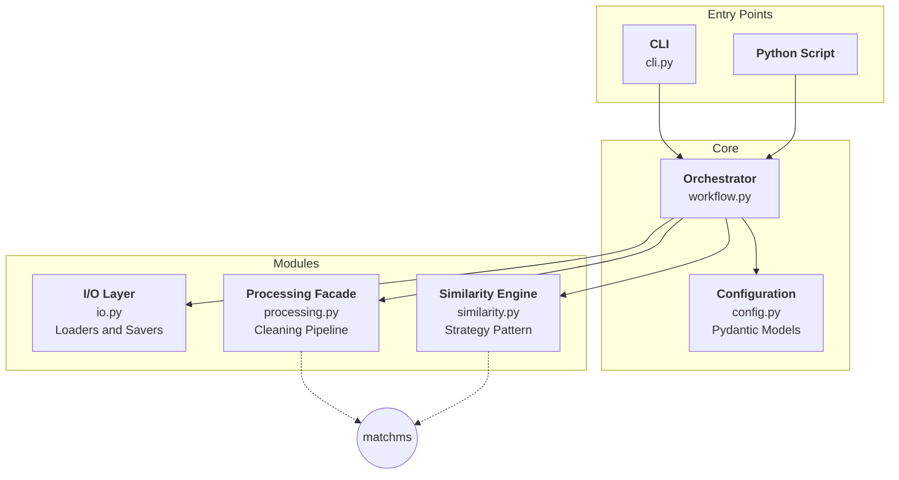

# MassFlow

**MassFlow** is a lightweight Python toolkit for processing, cleaning, and analyzing tandem mass spectrometry (MS/MS) data. It leverages the [matchms](https://github.com/matchms/matchms) ecosystem to provide efficient spectral data handling and similarity calculations.

## Features

- **Pydantic Configuration**: Robust configuration management and validation for complex workflows.
- **Spectral Cleaning**: Automated metadata repair, peak filtering, and normalization using a configurable pipeline.
- **Unified I/O**: Seamless loading and saving of spectra in MGF, MSP, mzML, JSON, and Pickle formats.
- **Extensible Similarity Search**: Implements the Strategy pattern for flexible integration of Cosine, Modified Cosine, and future similarity algorithms.
- **CLI & Library**: Use as a command-line tool or import as a Python library.

## Installation

### Prerequisites

- Python 3.10+

### Install from Source

```bash
git clone https://github.com/yourusername/MassFlow.git
cd MassFlow
pip install .
```

### Development Setup

```bash
pip install -r requirements.txt
```

## Usage

MassFlow provides a CLI entry point `massflow` (or `MassFlow` depending on installation).

### Command Line Interface (CLI)

#### 1. Run the Full Processing Pipeline

Execute a complete MassFlow pipeline (ingestion, processing, similarity search, result saving) using a YAML configuration file.

```bash
massflow process config.yaml
```

Example `config.yaml`:
```yaml
# MassFlow Configuration Example
input:
  file_path: data/query_spectra.mgf
  format: mgf
  reference_library: data/reference_library.msp

processing:
  min_peaks: 6
  min_intensity: 0.001
  normalize_intensity: true
  clean_metadata: true

similarity:
  algorithm: cosine # or modified_cosine
  tolerance: 0.01
  tolerance_unit: Da # or ppm
  min_score: 0.7
  analog_search: false

output_directory: results/my_analysis
```

#### 2. Clean and Convert a Library

Process an input spectral file to apply default filters (or specified in `ProcessingConfig`) and save it in a new format.

```bash
# Clean an MSP file and save as Pickle (default output format)
massflow clean --input data/library.msp --output-dir processed_data/

# Clean an MGF file and save as MSP
massflow clean --input data/query.mgf --output-dir processed_data/ --format msp

# Clean an mzML file and save as JSON
massflow clean --input data/example.mzml --output-dir processed_data/ --format json
```

**Options:**

- `--input`: Path to input spectral file (.mgf, .msp, or .mzml).
- `--output-dir`: Directory to save the processed output.
- `--format`: Output format (`pickle`, `msp`, `mgf`, `json`). Default: `pickle`.

#### 3. Plot a Spectrum

Visualize a single spectrum from a library file.

```bash
# List top 20 compound names in a library
massflow plot --input data/library.msp

# List all compound names
massflow plot --input data/library.msp --more

# Plot a specific spectrum by name
massflow plot --input data/library.msp --name "Compound X"

# Plot from an MGF file
massflow plot --input data/query.mgf --name "Query Spectrum 1"
```

**Options:**

- `--input`: Path to input spectral file (.mgf, .msp, or .mzml).
- `--name`: Name of the spectrum to plot (case-insensitive match).
- `--more`: List all spectrum names in the input file.

### Python Library

You can use MassFlow modules directly in your Python scripts.

#### Processing Spectra

```python
from pathlib import Path
from MassFlow.config import ProcessingConfig
from MassFlow import io, processing

# Load raw spectra from a file
raw_spectra = io.load_spectra(Path("data/test.mgf"), "mgf")

# Define processing configuration
proc_config = ProcessingConfig(
    min_peaks=10,
    min_intensity=0.005,
    normalize_intensity=True,
    clean_metadata=True
)

# Process spectra through the pipeline
processed_spectra = list(processing.process_spectra(raw_spectra, proc_config))

print(f"Loaded {len(list(raw_spectra))} raw spectra.") # Note: raw_spectra iterator consumed above, re-load if needed
print(f"Processed {len(processed_spectra)} valid spectra.")

# Save processed spectra to a new file
io.save_spectra_to_msp(processed_spectra, Path("processed_data/cleaned_test.msp"))
```

#### Similarity Calculations

```python
from pathlib import Path
from MassFlow.config import SimilarityConfig
from MassFlow import io, similarity

# Assuming you have processed reference and query spectra (as lists of matchms.Spectrum)
# For example, using the processing pipeline as shown above:
# reference_spectra = list(...)
# query_spectra = list(...)

# Dummy spectra for demonstration
from matchms import Spectrum
reference_spectra = [Spectrum(mz=list(range(100, 200)), intensities=[x/200 for x in range(100,200)], metadata={"name": "Ref A", "precursor_mz": 150.0})]
query_spectra = [Spectrum(mz=list(range(101, 201)), intensities=[x/200 for x in range(101,201)], metadata={"name": "Query X", "precursor_mz": 151.0})]


# Define similarity configuration
sim_config = SimilarityConfig(
    algorithm="modified_cosine",
    tolerance=0.01,
    min_score=0.7,
    min_matched_peaks=5
)

# Get the appropriate similarity calculator strategy
calculator = similarity.get_similarity_calculator(sim_config)

# Calculate scores
scores = calculator.calculate(reference_spectra, query_spectra)

# Get top matches for the first query spectrum
query_spectrum = query_spectra[0]
best_matches = scores.scores_by_query(query_spectrum, sort=True)

if best_matches:
    top_hit_spectrum, score_data = best_matches[0]
    print(f"Top match for '{query_spectrum.get('name') or 'Unknown'}':")
    print(f"  Matched to: '{top_hit_spectrum.get('name') or 'Unknown'}'")
    print(f"  Score: {score_data[f'{sim_config.algorithm.capitalize()}_score']:.4f}")
    print(f"  Matches: {score_data[f'{sim_config.algorithm.capitalize()}_matches']}")
else:
    print(f"No matches found for '{query_spectrum.get('name') or 'Unknown'}'.")

# You can also save structured results using the io module
results_list = []
if best_matches:
    top_hit_spectrum, score_data = best_matches[0]
    results_list.append({
        "Query_ID": query_spectrum.get("id", "N/A"),
        "Query_Name": query_spectrum.get("compound_name", query_spectrum.get("name", "Unknown")),
        "Match_Name": top_hit_spectrum.get("compound_name", top_hit_spectrum.get("name", "Unknown")),
        "Score": f"{score_data[f'{sim_config.algorithm.capitalize()}_score']:.4f}",
        "Matches": score_data[f'{sim_config.algorithm.capitalize()}_matches'],
        "Smiles": top_hit_spectrum.get("smiles", ""),
        "InChIKey": top_hit_spectrum.get("inchikey", "")
    })
io.save_match_results(results_list, Path("results/my_first_search.csv"))
```

## Workflow & Architecture

MassFlow's architecture is designed for modularity and extensibility. The `workflow.py` module orchestrates the entire process, leveraging specialized modules for configuration, I/O, spectral processing, and similarity calculations.


```mermaid
graph TD
    subgraph Entry Points
        CLI["<b>CLI</b><br>cli.py"]
        Script["<b>Python Script</b>"]
    end

    subgraph Core
        Config["<b>Configuration</b><br>config.py<br>Pydantic Models"]
        Workflow["<b>Orchestrator</b><br>workflow.py"]
    end

    subgraph Modules
        IO["<b>I/O Layer</b><br>io.py<br>Loaders and Savers"]
        Process["<b>Processing Facade</b><br>processing.py<br>Cleaning Pipeline"]
        Sim["<b>Similarity Engine</b><br>similarity.py<br>Strategy Pattern"]
    end

    %% Flow Connections
    CLI --> Workflow
    Script --> Workflow
    
    Workflow --> Config
    Workflow --> IO
    Workflow --> Process
    Workflow --> Sim

    %% Data Dependencies
    Process -.-> External((matchms))
    Sim -.-> External
```

- **`MassFlow.cli`**: The command-line interface entry point. Parses arguments and dispatches commands.
- **`MassFlow.config`**: Defines and validates the system's configuration using Pydantic models.
- **`MassFlow.workflow`**: The central orchestration engine that coordinates loading, processing, and similarity search based on the provided configuration.
- **`MassFlow.io`**: Handles reading from and writing to various spectral data formats (MGF, MSP, mzML, JSON, Pickle) and manages result output (CSV).
- **`MassFlow.processing`**: A facade for `matchms` filtering, applying a structured pipeline of metadata cleaning, peak filtering, and normalization.
- **`MassFlow.similarity`**: Implements spectral similarity calculations using the Strategy Pattern, allowing for easy addition of new algorithms.

## Testing

Run the test suite using `pytest`:

```bash
pytest
```

## License

MIT License