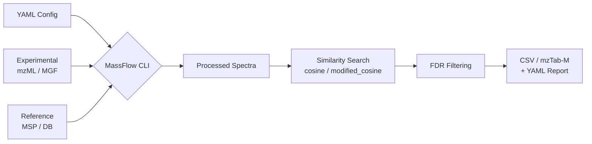
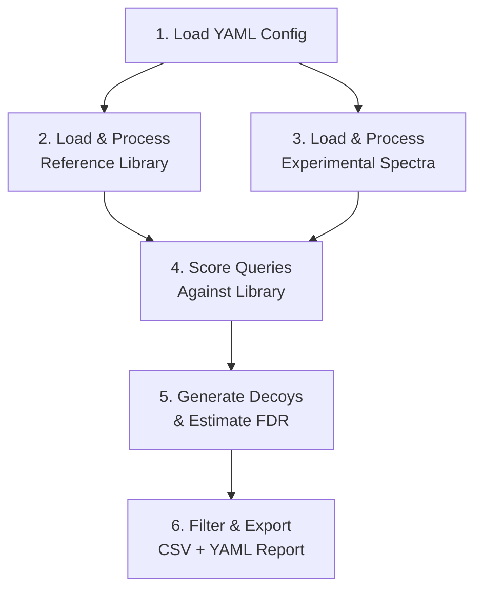
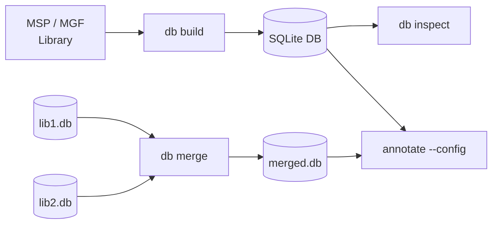

# MassFlow (v0.1.0)

[](https://ericjanusson.github.io/MassFlow/)

MassFlow is a program for local tandem mass spectrometry (MS/MS) annotation. It is designed to be config-first Python toolkit for local  **very easy to run** locally, producing highly reproducible outputs.

### The MassFlow Way
MassFlow is built on three core pillars:
1. **Precision**: Strict 5.0 ppm precursor mass validation and physics-informed models guarantee structural integrity.
2. **Portability**: Vendor-agnostic, open-format ingestion (`.mzML`, `.mgf`) keeps your data pipeline flexible.
3. **Performance**: Vectorized calculations and local SQLite backends allow for rapid, memory-aware searching.

### Try it in 30 seconds:
```shell
# One-liner to generate tutorial data, build the database, and run annotation
uv run massflow tutorial

# Then follow the printed commands to build the DB and annotate
uv run massflow db build --input tutorial/tutorial_library.msp --output tutorial/results/compiled_library.db --config tutorial/tutorial_config.yaml --category library
uv run massflow annotate --config tutorial/tutorial_config.yaml
```

Its core workflow is simple:

1. load an experimental spectral file
2. load a reference library
3. apply configurable `matchms` processing
4. score query spectra against the library
5. write per-file CSV or mzTab-M results


```mermaid
graph LR
    Config[YAML Config] --> CLI{MassFlow CLI}
    Input[Experimental<br/>mzML / MGF] --> CLI
    Library[Reference<br/>MSP / DB] --> CLI
    CLI --> Processed[Processed Spectra]
    Processed --> Sim[Similarity Search<br/>cosine / modified_cosine]
    Sim --> FDR[FDR Filtering]
    FDR --> Out[CSV / mzTab-M<br/>+ YAML Report]
```

## Stable vs experimental at a glance

| Surface | Status | Notes |
| --- | --- | --- |
| `massflow tutorial` | Stable target | Generates synthetic data for evaluation; see the [Usage Guide](docs/user-guide/usage.md) |
| `massflow annotate --config ...` | Stable target | Main documented workflow |
| YAML configuration | Stable target | Prefer `library_path`; `reference_library` is deprecated and remains accepted only as a backward-compatible alias during the transition |
| Open-format ingestion (`mzML`, `mzXML`, `MGF`, `MSP`) | Stable target | Vendor raw conversion is out of scope |
| SQLite library workflows (`massflow db ...`) | Stable target | Recommended for reusable local libraries |
| `cosine` and `modified_cosine` | Stable target | Best-supported scoring paths |
| CSV, mzTab-M export | Stable target | Main reporting surfaces |

## What MassFlow is for

MassFlow is designed for local, reproducible MS/MS annotation workflows where you want to:

- run annotation from the command line
- keep preprocessing settings in a YAML file
- use open formats such as `mzML`, `mzXML`, `MGF`, and `MSP`
- reuse processed reference libraries through SQLite
- export simple tabular results (CSV, mzTab-M) for downstream review

## What is stable vs experimental

### Core workflow for `v0.1`
These are the parts to rely on first:

- `massflow tutorial` — generates synthetic data for instant evaluation
- `massflow annotate --config ...`
- YAML configuration loading and validation
- open-format ingestion for `mzML`, `mzXML`, `MGF`, and `MSP`
- SQLite library workflows through `massflow db`
- configurable `matchms`-based metadata and peak filtering
- similarity search with `cosine` and `modified_cosine`
- per-file CSV and mzTab-M result export

## Documentation

Comprehensive documentation, including API references, experimental guides, and deep-dives into processing, is available at: **[https://ericjanusson.github.io/MassFlow/](https://ericjanusson.github.io/MassFlow/)**

## Installation and Dependency Policy

MassFlow requires **Python 3.10+**.

The project uses `pyproject.toml` and `uv.lock` as the single source of truth for packaging, versioning, and dependencies. Using `uv` is strictly recommended to ensure reproducible environments.

```shell
pip install massflow-ms  # Or your preferred distribution method
# or
git clone https://github.com/ejanusson/massflow && cd massflow && uv sync
```

## Quickstart

### 0. Try it instantly with tutorial data

If you don't have MS/MS files handy, generate a synthetic dataset and run the full pipeline in under a minute:

```shell
uv run massflow tutorial
```

This creates a `tutorial/` directory with a reference library, experimental queries, and a pre-configured YAML config. Follow the printed next-steps commands to build the database and run the annotation — no external files required.

For a complete walkthrough, see the [Usage Guide](docs/user-guide/usage.md).

### 1. Choose your inputs

You need:

- one experimental file, for example `example.mzML`
- one reference library, for example `library.msp`

MassFlow directly supports open formats. It does **not** convert vendor raw formats for you.

Supported user-facing input formats:

- `mzML`
- `mzXML`
- `MGF`
- `MSP`

SQLite libraries are also supported for explicit file inputs such as a reference library path.

### 2. Create or edit a config file

You can generate a starter config:

```shell
uv run massflow init --output massflow_config.yaml
```

Then edit the key fields:

```yaml
project:
  name: "Standard_Annotation_Project"
  output_directory: "results/standard_analysis"

input:
  input_path: "data/experiments/experiment.mzML"
  library_path: "data/libraries/library.msp"
  format: "mzml"

processing:
  clean_metadata: true
  filter_by_intensity: true
  noise_threshold: 1000.0
  min_intensity: 0.0
  filter_min_peaks: true
  min_peaks: 5

similarity:
  algorithm: "cosine"
  ms1_tolerance: 0.02
  ms2_tolerance: 0.02
  tolerance_unit: "Da"
  min_score: 0.6
  min_matched_peaks: 3
  fdr_threshold: 0.05

export:
  # Available formats: "csv", "mztab"
  format: "csv"
```

### 3. Run annotation

```shell
uv run massflow annotate --config massflow_config.yaml
```

### 4. Check the results

MassFlow writes one CSV (or mzTab-M) file per experimental input into `project.output_directory`.

For an input file named `example.mzML`, expect outputs like:

- `results/standard_analysis/example_results.csv`
- `results/standard_analysis/example_results.report.yaml`

The CSV contains the annotation table itself.

The sidecar report is intended to capture the provenance of that CSV, including details such as:

- when the analysis was run
- which query file was processed
- which library file or database was used
- which config file path produced the run
- the parsed processing, similarity, workflow, and export settings that were applied
- enough run metadata to connect the reported CSV back to the exact analysis context

The CSV includes matched and unmatched query spectra. Unmatched rows are still written so you can review what was searched.

If a query spectrum has no retained match after score and FDR filtering, the row is still exported and the match-specific columns are left empty. In the current workflow, these rows are useful for confirming that the input was processed even when no annotation was found.

A simplified no-match example looks like this:

```csv
query_id,query_precursor_mz,reference_id,reference_name,score,Annotation_Status
example_query_0,304.0,,,,Unknown
```

## How the program works


```mermaid
graph TD
    Config[1. Load YAML Config] --> Ref[2. Load & Process<br/>Reference Library]
    Config --> Exp[3. Load & Process<br/>Experimental Spectra]
    Ref --> Score[4. Score Queries<br/>Against Library]
    Exp --> Score
    Score --> Decoy[5. Generate Decoys<br/>& Estimate FDR]
    Decoy --> Filter[6. Filter & Export<br/>CSV + YAML Report]
```

At a high level, the annotation workflow does this:

1. load the YAML config
2. load and process the reference library
3. load and process the experimental spectra
4. score queries against the library
5. estimate target-decoy false discovery rate
6. keep retained matches and export the results (e.g. CSV + YAML sidecar)

A few practical details matter:

- reference libraries are processed through the same configured filtering pipeline as the queries
- searches are chunked to avoid loading the entire reference library into one large scoring pass
- results are filtered per experimental file before export
- if a small reference library is used, FDR may be overly strict and remove many hits

## Example: annotate a local file against a local library

If your project contains:

- `data/experiments/COE001_16ppm_5uL.mzML`
- `data/libraries/example_library.msp`

then a minimal config would look like:

```yaml
project:
  output_directory: "results/standard_analysis"

input:
  input_path: "data/experiments/COE001_16ppm_5uL.mzML"
  library_path: "data/libraries/example_library.msp"
  format: "mzml"

similarity:
  algorithm: "cosine"
```

and you would run:

```shell
uv run massflow annotate --config massflow_config.yaml
```

## Database workflows

For repeated analyses, you can preprocess a library into SQLite.


```mermaid
graph LR
    MSP[MSP / MGF<br/>Library] --> Build[db build]
    Build --> DB[(SQLite DB)]
    DB --> Inspect[db inspect]
    DB --> Annotate[annotate --config]
    DB1[(lib1.db)] --> Merge[db merge]
    DB2[(lib2.db)] --> Merge
    Merge --> Merged[(merged.db)]
    Merged --> Annotate
```

### Build a database

```shell
uv run massflow db build --input data/libraries/example_library.msp --output results/example_library.db --config massflow_config.yaml --category library
```

### Inspect a database

```shell
uv run massflow db inspect results/example_library.db
```

### Merge databases

```shell
uv run massflow db merge --inputs results/lib1.db results/lib2.db --output results/merged.db
```

You can then use the resulting `.db` file as the configured library input path.

The preferred config key is `library_path`.

`reference_library` is deprecated in documentation and examples, but it is still accepted as a backward-compatible alias during the current transition period. New configs should use `library_path`.

The reported CSV output should also be accompanied by a sidecar report so the result table keeps a hard link back to the run settings that produced it. In practice, this report should record both the original config path and the parsed settings that were actually applied during the run.

## Managing a local user database

A practical pattern is to maintain your own local SQLite library for in-house standards, curated references, or project-specific compounds.

A simple workflow is:

1. start from one or more library files in `MSP` or `MGF`
2. build a SQLite database with `massflow db build`
3. inspect it with `massflow db inspect`
4. merge multiple local databases with `massflow db merge` when needed
5. point `input.library_path` at the resulting `.db` file

For example, you might keep:

- `results/user_library.db` for your main curated local library
- `results/standards.db` for authenticated standards
- `results/project_x_library.db` for project-specific spectra

Then merge them into one search library when appropriate:

```shell
uv run massflow db build --input data/libraries/example_library.msp --output results/user_library.db --config massflow_config.yaml --category personal
uv run massflow db inspect results/user_library.db
uv run massflow db merge --inputs results/user_library.db results/standards.db --output results/master_user_library.db
```

After that, set your config to use the merged library:

```yaml
input:
  input_path: "data/experiments/experiment_file.mzML"
  library_path: "results/master_user_library.db"
  format: "mzml"
```

The database layer stores spectra plus metadata and a category label, so categories such as `reference`, `personal`, `standards`, or `project_x` can help you keep local libraries organized.

## Processing controls

MassFlow exposes common `matchms`-based processing steps through YAML settings.

Examples include:

- metadata cleaning
- retention time extraction
- identifier repair
- intensity filtering
- minimum peak count enforcement
- m/z truncation
- top-N peak reduction
- intensity normalization

This makes preprocessing reproducible and easier to review than ad hoc scripts.

## Similarity engines

### Stable search paths
These are the choices for the current core workflow:

- `cosine`
- `modified_cosine`

If you need the broadest compatibility and simplest behavior, start with `cosine`.

## Python API

MassFlow can also be used from Python.

For core engines such as `cosine` and `modified_cosine`:

```python
from pathlib import Path

from MassFlow import io
from MassFlow.config import MassFlowConfig
from MassFlow.similarity import SimilarityEngine

query_spectra = list(io.load_spectra(Path("data/experiments/example.mgf"), "mgf"))
reference_spectra = list(io.load_spectra(Path("data/libraries/example_library.msp"), "msp"))

config = MassFlowConfig.from_yaml("massflow_config.yaml")
engine = SimilarityEngine(config.similarity)
results = engine.search(query_spectra, reference_spectra)
```

## Testing

Run the test suite with:

```shell
uv run pytest
```

## Notes on supported data

MassFlow is intentionally conservative at the I/O boundary.

- open formats are supported directly
- vendor raw formats are rejected instead of being converted implicitly
- large raw datasets and reference libraries are best kept outside the repository
- SQLite libraries are useful when you want faster repeated library access

## Repository guide

- `README.md`: quickstart and user-facing overview
- `ARCHITECTURE.md`: module responsibilities and data flow
- `docs/user-guide/`: technical manuals and metadata contracts
- `docs/post-v0.1-roadmap.md`: future development

## License

MIT. See `LICENSE`.
