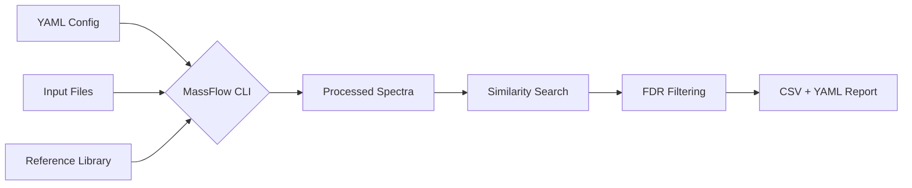

# Quickstart Guide

This guide walks you through your first end-to-end tandem mass spectrometry (MS/MS) annotation run using MassFlow's stable CLI workflow.

---

## Workflow at a Glance



---

## 0. Try It Instantly with Tutorial Data

If you want to evaluate MassFlow right now without hunting down MS/MS files, use the built-in tutorial generator:

```shell
uv run massflow tutorial
```

This creates a `tutorial/` directory with everything you need: a reference library, experimental queries, and a pre-configured YAML config. Then follow the printed next-steps commands to build the database and run an annotation — all in under a minute.

For a complete walkthrough, see the [Usage Guide](../user-guide/usage.md).

---

## 1. Choose Your Inputs

You need:
1.  **One experimental file** (e.g., `experiment.mzML`).
2.  **One reference library** (e.g., `library.msp` or an existing SQLite `.db` library).

!!! warning "Vendor Raw Formats"
    MassFlow core pipeline directly supports open formats. It **does not** implicitly convert vendor raw formats (like `.raw`, `.d`, `.wiff`, `.lcd`) during the annotation run.

    You must pre-convert vendor files to `.mzML` prior to running MassFlow. We provide a convenient wrapper command to do this using ProteoWizard's MSConvert (if installed on your system):
    ```shell
    uv run massflow convert --input data/raw/ --output data/experiments/
    ```

**Supported user-facing input formats:**
*   `.mzML`
*   `.mzXML`
*   `.MGF`
*   `.MSP`
*   `.db` / `.sqlite` (MassFlow native databases)

---

## 2. Create a Starter Configuration

MassFlow is a "config-first" toolkit. Rather than passing dozens of flags into the terminal, you manage your analysis via a single YAML file.

Generate a canonical starter configuration:

```shell
uv run massflow init --output massflow_config.yaml
```

Open `massflow_config.yaml` in your favorite text editor. It is pre-populated with standard `matchms` processing filters and the classical `cosine` similarity algorithm.

Update the `input` block to point to your files:

```yaml title="massflow_config.yaml"
project:
  name: "Standard_Annotation_Project"
  output_directory: "results/standard_analysis"

input:
  # Mandatory paths to your spectral data
  input_path: "data/experiments/experiment.mzML"
  library_path: "data/libraries/library.msp"
  format: "mzml"

processing:
  # Standard filters (clean_metadata, filter_min_peaks, etc.)
  # ...

similarity:
  # Classical algorithm
  algorithm: "cosine"
  ms1_tolerance: 0.02
  ms2_tolerance: 0.02
  min_score: 0.6
  min_matched_peaks: 3
  fdr_threshold: 0.05

export:
  format: "csv"
```

!!! tip "Directories instead of files"
    If you have a batch of experimental files, you can point `input_path` to a folder instead of a single file. MassFlow will recursively process all supported spectral files in that folder in parallel.

---

## 3. Run the Annotation

Execute the core workflow by passing your configuration to the CLI:

```shell
uv run massflow annotate --config massflow_config.yaml
```

MassFlow will:
1. Load the YAML config and validate your file paths.
2. Ingest and process the reference library through the defined metadata and peak filters.
3. Discover your experimental queries and process them identically.
4. Score queries against chunked reference libraries.
5. Compute a Target-Decoy False Discovery Rate (FDR).
6. Keep retained matches and export the results.

---

## 4. Interactive 'Watch' Mode

If you are actively tweaking your noise thresholds or similarity parameters, you don't need to manually re-run the `annotate` command every time. MassFlow provides an interactive live-reloading UI:

```shell
uv run massflow watch --config massflow_config.yaml
```

This launches a real-time Rich table in your terminal. Whenever you save changes to your files or configuration, MassFlow will automatically re-run the pipeline and update the results preview on your screen.

---

## 5. Check the Results

MassFlow writes one CSV report per experimental input file directly into `project.output_directory`.

If your input file was named `experiment.mzML`, expect two outputs:
1. `results/standard_analysis/experiment_results.csv`
2. `results/standard_analysis/experiment_results.report.yaml`

### The CSV Result Table
The CSV contains the actual annotation hits, including the computed `score`, `matched_peaks`, and an automated `Annotation_Status` tag (e.g., `Matched`, `Putative`, or `Unknown`).

!!! note "Unmatched Queries"
    The CSV includes matched *and* unmatched query spectra. If a query spectrum has no retained hit after score and FDR filtering, the row is still exported, but the reference-specific columns are left blank. This allows you to confirm that the input was successfully processed.

```csv title="experiment_results.csv (Simplified No-Match Example)"
query_id,query_precursor_mz,reference_id,reference_name,score,Annotation_Status
example_query_0,304.0,,,,Unknown
```

### The Provenance Sidecar Report
The sidecar report (`.report.yaml`) acts as a hard link between your CSV results and the run conditions that produced it. It captures:

- When the analysis was run.
- Which query file and library file were used.
- The path to the original `massflow_config.yaml`.
- The exact parsed configurations (`processing`, `similarity`, `workflow`) that were applied.

This ensures you can always reproduce how a specific CSV was generated months later.
