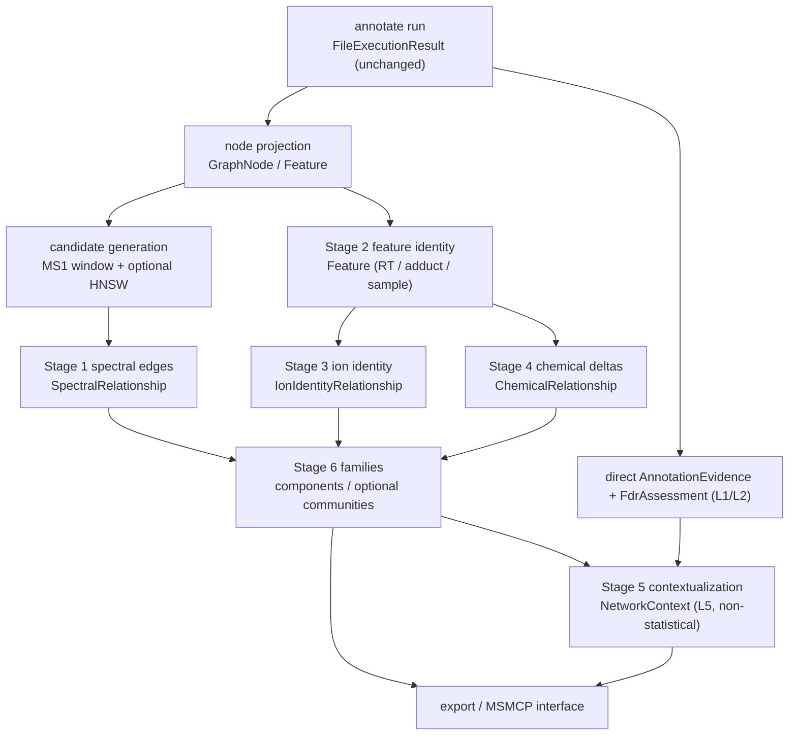

# Network-Aware MS Annotation — Frozen Design Specification

> **STATUS: FROZEN DESIGN SPECIFICATION (Spec 1.6, 2026-10-01).**
>
> **Amendments (record-keeping only; no design change).**
>
> * **1.1 (2026-10-01):** Phase **P1** (Stage 1 spectral networking) implemented
>   — experimental, disabled by default, via `massflow network build` and
>   `MassFlow.network.{candidates,spectral,build}`.
> * **1.2 (2026-10-01):** Phase **P2** (Stage 2 feature-based networking)
>   implemented — deterministic LC-MS feature identity with a highest-TIC
>   representative via `MassFlow.network.features.build_features`, integrated
>   into `build_spectral_graph`.
> * **1.3 (2026-10-01):** Phase **P3** (Stage 3 ion-identity relationships)
>   implemented — adduct / same-molecule links via
>   `MassFlow.network.ion_identity.build_ion_identity_relationships`, with
>   fail-closed unknown adducts. Also: **R-1 addressed** — spectral scoring is
>   candidate-driven and no longer materializes an `N x N` matrix (§10).
> * **1.4 (2026-10-01):** Phase **P4** (Stage 4 chemical relationships)
>   implemented — neutral-loss **hypotheses** via
>   `MassFlow.network.chemical.build_chemical_relationships`.
> * **1.5 (2026-10-01):** Phase **P5** (Stage 5 contextualization) implemented —
>   `NetworkContext` / `AnnotationInference` (L5) via
>   `MassFlow.network.context.contextualize`, with structural anti-circularity.
>   The deterministic connected-components primitive
>   (`MassFlow.network.families`) is pulled forward from P6 as its prerequisite.
> * **1.6 (2026-10-01):** Phase **P6** (Stage 6 families + Stage 7 MSMCP)
>   implemented — `MolecularFamily` records via
>   `MassFlow.network.families.detect_families`, family JSONL export, the offline
>   read-only `MassFlow.network.msmcp.LocalGraphSource`, and
>   `massflow network analyse/export`. Community detection and a networked MCP
>   server remain deferred (ML / optional-extra territory).
>
> All plan phases P1–P6 are now implemented; community detection, SQLite graph
> persistence, GraphML/Cytoscape/FBMN, and visualization remain deferred.
>
> **Not a product contract.** Where this document conflicts with
> [`docs/CAPABILITY_MATRIX.md`](CAPABILITY_MATRIX.md), **the capability matrix
> governs** until it is amended.
>
> **Change control.** Frozen 2026-10-01; amended to Spec 1.6 (2026-10-01).
> Amendments require a numbered revision (Spec 1.7, 1.8, …) plus a changelog
> entry. Any change to the confidence model (§7) requires re-review against
> `CAPABILITY_MATRIX.md` §1.

---

## 1. Purpose and scope

Specify a **local-first, precision-first** molecular-networking subsystem for
MassFlow, built strictly on top of the annotation engine and the graph-ready
data layer ([`MassFlow.network`](network-data-model.md)). The subsystem supports
this analytical pipeline:

```
spectra / features → annotation → pairwise relationships → molecular graph
                   → molecular-family analysis → network-aware interpretation
```

**In scope:** spectral networking; feature-based networking; ion-identity and
chemical relationships; annotation contextualization; molecular-family
analysis; a local machine-readable interface (MSMCP); design for a future
repository-scale retrieval layer.

**Out of scope:** any change to the stable annotation path, the meaning of
q-values/FDR, or the v1.0 contract.

---

## 2. Guiding principles (not a GNPS clone)

GNPS-style networking is a cloud platform whose product is a browsable graph.
MassFlow's subsystem is an **analytical strategy** layered on annotation + LC-MS
feature information.

| GNPS-style | MassFlow Network-Aware MS Annotation |
| --- | --- |
| Cloud service, internet-scale library | **Local-first**; runs fully offline |
| Graph is the *product* | Graph is an **analytical strategy** |
| Similarity network primarily | **Typed, provenance-carrying edges** (spectral, ion-identity, chemical) |
| Coverage over precision | **Precision-first**, explicit uncertainty, deterministic by default |
| Implicit confidence | **Structural separation** of similarity, chemical relations, and FDR |

1. Everything is a **read-only projection** of the annotation engine.
2. **Network context never alters primary statistical confidence** (§7).
3. **Classical, deterministic algorithms by default**; ML is optional and delegated.
4. Every edge and family carries **explainable provenance**.
5. The graph is **machine-readable**; no internet-scale service is required.

---

## 3. Relationship to the shipped baseline

This specification consumes — and does not modify — the following shipped
surfaces:

| Baseline component | Use in this subsystem |
| --- | --- |
| `MassFlow.network` (v1.0 data layer) | All node/edge/evidence/provenance types; the `MolecularGraph` container |
| `MassFlow.similarity.SimilarityEngine` | Pairwise scoring (`include_decoys=False`; decoys are an annotation-only FDR device) |
| `MassFlow.acceleration` / `MassFlow.hnsw` | Numba prefilter; optional HNSW candidate generation |
| `MassFlow.storage.SpectralStore` | Peak-array retrieval by node id |
| `MassFlow.cheminformatics` | `compute_adduct_offset`, `adduct_charge`, `normalize_adduct`, isotopic machinery |
| `MassFlow.models` | `TriageProfile` (node quality), structural metadata |
| `MassFlow.database` (`library_builds`) | Build lineage referenced by edge provenance |
| `MassFlow.protocols.MLEngineProtocol` / `ml_client` | Optional ML delegation boundary |

The subsystem is **downstream**: the stable path never imports it, and it
imports none of `workflow`/`cli`/`database`/`io` except through sanctioned
boundaries (`io.py` for writes; `database.py` for any future persistence).

---

## 4. Architecture overview



---

## 5. Module boundaries

All modules are **new** and live under a single package. None is imported by the
stable annotation path.

```
MassFlow/network/            # v1.0 data layer, promoted from network.py to a package
  __init__.py                # re-exports GraphNode, ..., MolecularGraph (v1.0 types)
  candidates.py              # candidate pair generation (MS1 window; optional HNSW)
  spectral.py                # Stage 1 — spectral edges
  features.py                # Stage 2 — feature identity
  ion_identity.py            # Stage 3 — same-molecule edges
  chemical.py                # Stage 4 — related-molecule hypotheses
  context.py                 # Stage 5 — contextualization (L5, non-statistical)
  families.py                # Stage 6 — family analysis
  build.py                   # orchestration: results -> MolecularGraph
  export.py                  # machine-readable export (delegates writes to io.py)
  msmcp.py                   # Stage 7 — local machine interface
  config.py                  # NetworkConfig (Pydantic; disabled by default)
```

**Boundary rules (binding):**
- **File I/O** only through `MassFlow.io` (e.g. `save_molecular_graph`, future
  `save_families`).
- **All SQL/schema** only in `MassFlow.database` (any graph persistence is a new
  table family with a migration note at the top of that file).
- **Configuration** is a Pydantic `NetworkConfig`, surfaced as a `network:` YAML
  section, **disabled by default** (mirroring the empty `WorkflowConfig`).
- **CLI** commands are experimental and explicitly labeled.

---

## 6. Stages

### Stage 1 — Spectral networking

**Goal.** Connect nodes whose MS/MS spectra are similar, using the similarity
semantics already trusted on the stable path.

**Classical algorithm.** Exact candidacy via MS1 m/z windowing + m/z prefilter;
score with cosine/modified cosine through `SimilarityEngine` with
`include_decoys=False`. Optional approximate candidacy via the existing
experimental HNSW index.

**Thresholds (explicit, recorded in provenance).** `min_score`,
`min_matched_peaks`, `top_k_per_node`, `ms1_tolerance`, `ms2_tolerance`,
`tolerance_unit`, `rt_tolerance`.

**Edge evidence.** `SpectralRelationship` (`score`, `matched_peaks`, tolerances,
`algorithm`, provenance). By construction it has **no** q-value/p-value field.

**Determinism.** Canonical (source, target) ordering; content-derived
`relationship_id` ⇒ idempotent re-runs.

**Complexity.** Naive all-vs-all `O(N²)` pairs, `O(P)` per pair; windowed
candidacy ≈ `O(N log N)`, sub-linear with HNSW. Edges are streamed, never a
materialized `N×N` matrix.

**API concept.** `generate_candidate_pairs(nodes, cfg)`,
`score_spectral_edges(pairs, store, cfg, *, engine)`,
`build_spectral_network(graph, cfg)`.

---

### Stage 2 — Feature-based networking

**Goal.** Make the LC-MS feature (m/z + RT + adduct + charge, possibly across
samples) a first-class node and relate features to their underlying spectra.

**Classical algorithm.** Deterministic grouping over `(ion_mode, charge,
adduct-family, precursor_mz ± tol, retention_time_seconds ± window)` via
grid/interval hashing (sort by RT, bucket by m/z tolerance, connected-component
within bucket). Representative MS/MS = the member with the highest summed
intensity, tie-broken by node id. Consensus spectra are a later ML-optional
enhancement bound to `Feature.representative_spectrum_node_id`.

**Reuses** the v1.0 `Feature.spectrum_node_ids` / `sample_id` / `abundance`
fields.

**Complexity.** `O(S log S)` time, `O(S)` space.

**API concept.** `build_features(graph, cfg)`.

---

### Stage 3 — Ion-identity relationships (same molecule)

**Goal.** Decide when two ions are the **same analyte** (adducts, isotopes,
multimers) versus **related** (in-source fragments).

**Classical algorithm.** Enumerate registry adduct hypotheses
(`cheminformatics._ADDUCT_SPECS`) against candidate neutral masses within a ppm
tolerance; match isotope spacings against expected neutron/halogen shifts.
Emit `IonIdentityRelationship(..., molecule_relationship="same_molecule")` for
adducts/isotopes/multimers and `"related_molecule"` for in-source fragments.
Unknown adducts **fail closed** (consistent with the 5 ppm gate).

**Complexity.** `O(F·(A + I))`, `A≈22` registry adducts, `I` small.

**API concept.** `build_ion_identity(graph, cfg)`.

---

### Stage 4 — Chemical relationships (related molecule, with uncertainty)

**Goal.** Represent precursor Δmass / neutral-loss relationships as
**hypotheses**, never automatic structural claims.

**Classical algorithm.** Exact-formula neutral-loss/transformation tables
(computed via `pyteomics`, consistent with `cheminformatics`) — e.g. H₂O, NH₃,
CO₂, CH₂O, SO₃, glycosyl/sulfate losses — matched within ppm tolerance. Emit
`ChemicalRelationship(..., interpretation_status="hypothesis",
molecule_relationship="related_molecule")`; unknown Δmass ⇒
`interpretation_status="unassigned"`, `molecule_relationship="unknown"`.

**Prohibition.** No structural claim may be asserted by an edge; interpretations
are strings explicitly tagged as hypotheses.

**Complexity.** `O(Σ k_f²)` per family, or `O(Σ k_f)` with a Δmass hash index.

**API concept.** `build_chemical_relationships(graph, cfg)`.

---

### Stage 5 — Annotation contextualization (non-circular)

**Goal.** Let high-confidence library hits provide **family context** to poorly
annotated nodes — without inflating statistical confidence or creating circular
evidence.

**Design (one-directional propagation).**
- A family inherits a **descriptive label** from its calibrated members, stored
  as **L5 `NetworkContext`** (`component_id`, `seed_annotation_ids`,
  `member_count`, `label`, `label_source`).
- **Anti-circularity rules (binding):**
  1. Network context **cannot** write to `FdrAssessment`/`AnnotationEvidence`.
  2. Inferred annotations are a **distinct type** `AnnotationInference`
     (`node_id`, `inferred_from_edge_ids`, `supporting_annotation_ids`,
     `status="network_inferred"`, `provenance`) and are **never** placed in the
     target-decoy pool; their null is undefined.
  3. Inference is **bounded**: only from families containing ≥1 direct,
     calibrated, high-confidence seed; **no inference of inferences**.
  4. Every inference records the exact edges/seeds for audit.

**Complexity.** `O(V + E)` per family.

**API concept.** `contextualize_annotations(graph, cfg) -> list[NetworkContext]`.

**New data-layer types (added with P5, same L1–L5 discipline):**
`NetworkContext`, `AnnotationInference`.

---

### Stage 6 — Molecular-family analysis

**Goal.** Turn the typed edge set into interpretable families with explainable
provenance and a machine-readable export.

**Design.**
- **Connected components** — the deterministic default. Union-find over edges
  in canonical order; `family_id` = digest of the sorted member node ids
  (stable across runs and input ordering).
- **Communities** — optional, ML-optional refinement (Louvain/Leiden/embedding).
  When enabled, classical components remain ground truth and communities attach
  as a sub-label with their own provenance.
- **Explainability.** Every member edge carries `RelationshipProvenance`; the
  family record references edge ids, so "why is this node in this family?" is
  answerable.
- **Export.** JSON/JSONL of the (`MolecularGraph` + families + inferences)
  document, written through `io.py`. **GraphML/Cytoscape are not the interface.**

**Complexity.** Components `O(V + E)`; communities `O(E log V)` (optional);
export `O(V + E)`, streamed.

**API concept.** `detect_families(graph, cfg) -> list[MolecularFamily]`;
`export_graph(graph, out_dir, cfg)`.

**New data-layer types (added with P6):** `MolecularFamily`.

---

### Stage 7 — MSMCP (local-first machine interface)

> **Interpretation.** "MSMCP" is taken to mean an **MCP-style** (Model Context
> Protocol) machine-readable interface over MassFlow's graph, served locally. If
> a specific external protocol was intended, Stage 7 is re-scoped.

**Goal.** Expose nodes, edges, annotations, evidence, and provenance through a
machine-readable interface without requiring any internet-scale service.

**Design.**
- Read-only adapter (`network/msmcp.py`) over a local `MolecularGraph` (file or
  local SQLite).
- Concepts: resources `graph`, `node/{id}`, `node/{id}/neighbors`,
  `family/{id}`, `evidence/{edge_id}`, `provenance/{...}`; queries "annotations
  for node", "edges between A and B", "families containing X", "seed
  annotations of family F", "explain edge E".
- **Transport-agnostic core** + a thin optional server (`massflow mcp serve`,
  experimental) and an in-process API for tests. Optional extras only.
- **Repository-scale later:** a `GraphSource` abstraction with
  `LocalGraphSource` (default, offline) and a future `RepositoryGraphSource`.
- **Confidence discipline:** FDR values are returned only from `FdrAssessment`,
  clearly namespaced; edges expose similarity/Δmass only; inferences are
  returned under a distinct `inferences` collection with
  `status="network_inferred"`.

---

## 7. Confidence governance (binding invariants)

| Layer | Carrier | Subsystem may… | Subsystem must not… |
| --- | --- | --- | --- |
| L1 direct evidence | `AnnotationEvidence` | read | modify |
| L2 statistical confidence | `FdrAssessment` (query-scoped) | read | recompute, propagate, threshold upon, or adjust |
| L3 similarity | `SpectralRelationship.score` | create | feed back into L2 |
| L4 chemical/ion-identity | Δmass edges | create | assert structure |
| L5 family context | `NetworkContext`, `MolecularFamily`, `AnnotationInference` | create | appear as q-value/score/tier |

- **No edge carries FDR**; primary hits are never re-ranked by network membership.
- **Inferences are a separate collection** with full provenance, never mixed
  into the target-decoy pool.
- **Determinism:** all classical outputs are reproducible from
  `(inputs, config)`; provenance records config digest and library build ids.

---

## 8. Classical vs ML delegation

| Stage | Classical/deterministic (default, core) | ML-optional (never required) |
| --- | --- | --- |
| 1 Spectral | cosine/modified cosine; MS1 window; m/z prefilter; exact top-k | HNSW candidacy (existing, experimental); spec2vec/ms2deepscore refinement for low-SNR/chimeric nodes via `MLEngineProtocol` |
| 2 Feature | RT+m/z grid hashing; TIC representative | consensus/averaged MS/MS; deconvolution; RT alignment |
| 3 Ion identity | adduct/isotope math (`pyteomics`, registry) | learned adduct/isotope resolution |
| 4 Chemical | formula neutral-loss tables; ppm gates | learned transformation ranking |
| 5 Context | bounded, audited seeding | family-label suggestion; embedding kNN summarization |
| 6 Families | connected components; deterministic ids | Louvain/Leiden/embedding communities |
| 7 MSMCP | local read-only query + provenance | semantic/embedding retrieval over a repository |

**Rule.** ML outputs are always additive, provenanced, and reversible; disabling
ML must leave every stage with a classical result.

---

## 9. API concepts, config, and CLI

**Signatures (illustrative API concepts — not implementation):**
- `build_graph(results, cfg, *, store) -> MolecularGraph`
- `build_spectral_network(graph, cfg, *, engine) -> None`
- `build_features(graph, cfg) -> None`
- `build_ion_identity(graph, cfg) -> None`
- `build_chemical_relationships(graph, cfg) -> None`
- `contextualize_annotations(graph, cfg) -> list[NetworkContext]`
- `detect_families(graph, cfg) -> list[MolecularFamily]`
- `export_graph(graph, out_dir, cfg) -> None`

**Configuration.** A `NetworkConfig` Pydantic model under a `network:` YAML
section, disabled by default; all thresholds, candidate mode (exact/approx), and
ML toggles are explicit and recorded in provenance.

**CLI (experimental).** `massflow network build`, `massflow network analyse`,
`massflow network export`, `massflow mcp serve`.

---

## 10. Computational complexity and scaling

| Stage | Time | Space | Notes |
| --- | --- | --- | --- |
| Candidates | `O(N log N)` exact; sub-linear with HNSW | `O(N)` | never materialize `N×N` |
| Spectral scoring | `O(E_cand · P)` | streamed `O(k)` | reuse vectorized scorer |
| Feature identity | `O(S log S)` | `O(S)` | grid/interval hash |
| Ion identity | `O(F·(A+I))` | `O(F)` | `A≈22`, `I` small |
| Chemical | `O(Σ k_f²)` or `O(Σ k_f)` | `O(E)` | Δmass index |
| Families | `O(V + E)`; communities `O(E log V)` | `O(V)` | union-find / Louvain |
| Export | `O(V + E)` | streamed | JSONL for large graphs |

**Defaults:** per-node `top_k` (small) + `min_score`. Log candidate/edge counts.
Ship an opt-in benchmark (`scripts/benchmark_network.py`, `benchmark`-marked).

> **Implementation note (P1, §10):** spectral scoring is candidate-driven — each
> unordered candidate pair is scored once as a bounded single-query search, so no
> `N x N` matrix is materialized regardless of particle count.

---

## 11. Staged implementation plan

| Phase | Deliverable | Exit criteria |
| --- | --- | --- |
| **P0** (done) | v1.0 graph data layer | merged; invariants + isolation tests green |
| **P1** (done) | `candidates.py`, `spectral.py`, `build.py` (spectral-only), `NetworkConfig`, `massflow network build`, JSON export | implemented — deterministic spectral graph; q-values untouched; `scripts/benchmark_network.py` |
| **P2** (done) | `features.py` (identity, TIC representative, sample context) | implemented — deterministic LC-MS features; membership stamped on nodes; `tests/test_network_features.py` |
| **P3** (done) | `ion_identity.py` (adduct/isotope; same vs related) | implemented — adduct (same-molecule) links with fail-closed unknown adducts; `tests/test_network_ion_identity.py` (isotope discovery deferred) |
| **P4** (done) | `chemical.py` (neutral-loss table; hypothesis status) | implemented — neutral-loss hypotheses with explicit `interpretation_status="hypothesis"`; `tests/test_network_chemical.py` |
| **P5** (done) | `context.py` (`NetworkContext`, `AnnotationInference`, anti-circularity) | implemented — L5 contexts/inferences; inference never enters the FDR pool; `tests/test_network_context.py` (families primitive pulled forward) |
| **P6** (done) | `families.py` (components; optional communities), `msmcp.py`, `massflow network analyse/export` | implemented — stable `MolecularFamily` ids, offline `LocalGraphSource`, `network analyse/export`; community detection deferred |

Each phase ships implementation, unit + known-answer scientific tests, an
invariant test proving `q_value`/`p_value` unchanged, docs, and an opt-in
benchmark.

---

## 12. Testing strategy

- **Known-answer scientific fixtures:** hand-built families (e.g. caffeine +
  Na/H adducts + isotope + a water-loss analogue) with exact expected edges and
  membership.
- **Invariant/regression:** building/analysing a graph leaves every
  `FdrAssessment` and `AnnotationEvidence` byte-identical; inference records
  never appear in the FDR pool.
- **Determinism/idempotence:** identical edge ids, component ids, and JSON on
  re-run; hash-seed independence.
- **Isolation:** the stable path never imports `network`; `network` never
  imports `workflow`/`cli`/`database` (except a future graph-persistence path).
- **Scale benchmarks:** opt-in, `benchmark`-marked.
- **ML paths:** `optional`-marked, skipped when extras are absent; classical
  results asserted identical with ML disabled.

---

## 13. Risks and open decisions

| # | Decision | Options | Impact |
| --- | --- | --- | --- |
| N-1 | Spectral candidacy | exact MS1-window (default) vs HNSW approximate (opt-in) | recall vs speed; HNSW experimental |
| N-2 | Feature identity params | m/z + RT + adduct-family vs adduct-agnostic m/z | over-/under-merging |
| N-3 | Representative MS/MS | TIC (deterministic) vs consensus (ML-optional) | explainability vs sensitivity |
| N-4 | Community detection | components only vs optional communities | scope/complexity |
| N-5 | Graph persistence | JSON-only vs SQLite (new tables in `database.py`) | query performance vs schema surface |
| N-6 | MSMCP transport/versioning | in-process + local CLI vs networked server | adoptability vs dependency |
| N-7 | Repository federation | design `GraphSource` now, implement later | future-proofing cost |
| N-8 | Doc reconciliation | fix stale FBMN/GraphML claims in `AGENTS.md` §5.4/§6.1 and roadmap §3 | consistency with `CAPABILITY_MATRIX.md` |

---

## 14. Non-goals

A GNPS cloud clone • internet-scale service as a requirement • GraphML/Cytoscape
as the core interface • FBMN export • visualization/GUI • network-aware
*scoring* of annotations • automatic structural elucidation • mandatory ML.

---

## 15. Change control

This specification is **frozen at Spec 1.0 and amended to Spec 1.6
(2026-10-01)**. Amendments require:

1. A numbered revision in this document's title and status block.
2. A changelog entry in [`docs/CHANGELOG.md`](CHANGELOG.md).
3. Re-review against [`docs/CAPABILITY_MATRIX.md`](CAPABILITY_MATRIX.md) §1 for
   any change to §7 (confidence governance) or to the in-scope stage list.

---

## 16. References

- [`docs/network-data-model.md`](network-data-model.md) — the v1.0 graph data layer.
- [`docs/CAPABILITY_MATRIX.md`](CAPABILITY_MATRIX.md) — authoritative product contract.
- [`docs/ARCHITECTURE.md`](ARCHITECTURE.md) — component responsibilities.
- [`docs/post-v0.1-roadmap.md`](post-v0.1-roadmap.md) — roadmap context.
- `AGENTS.md` — scientific, architectural, and testing standards.
