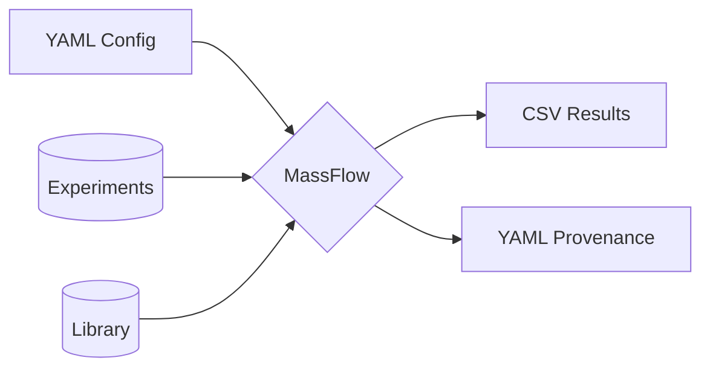
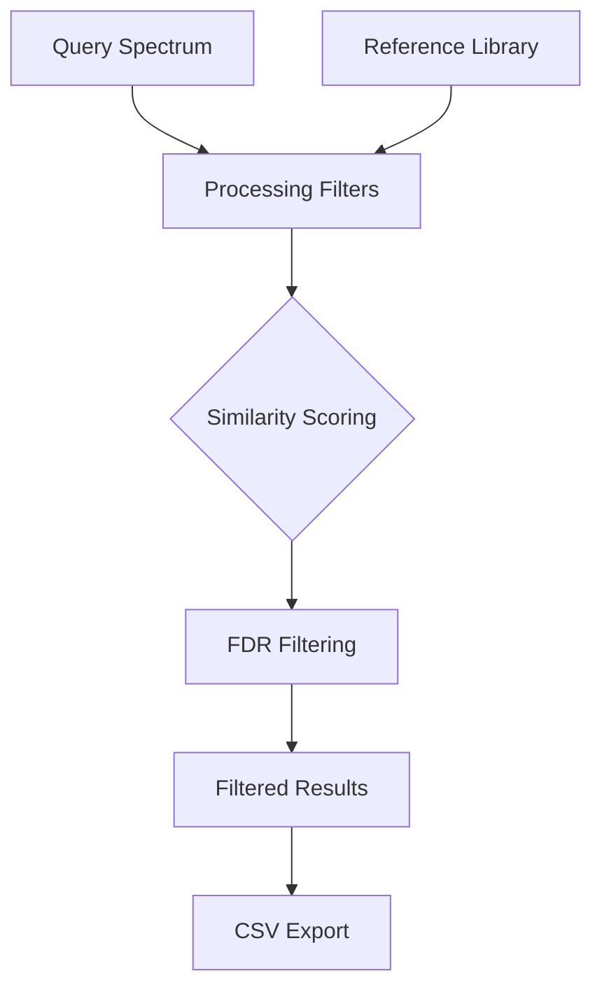
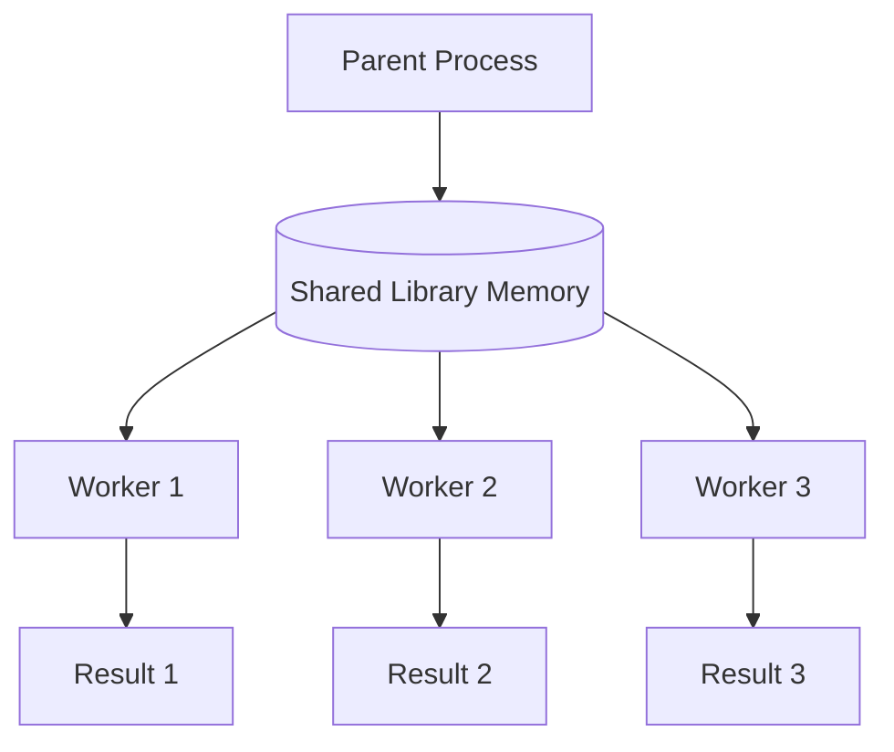
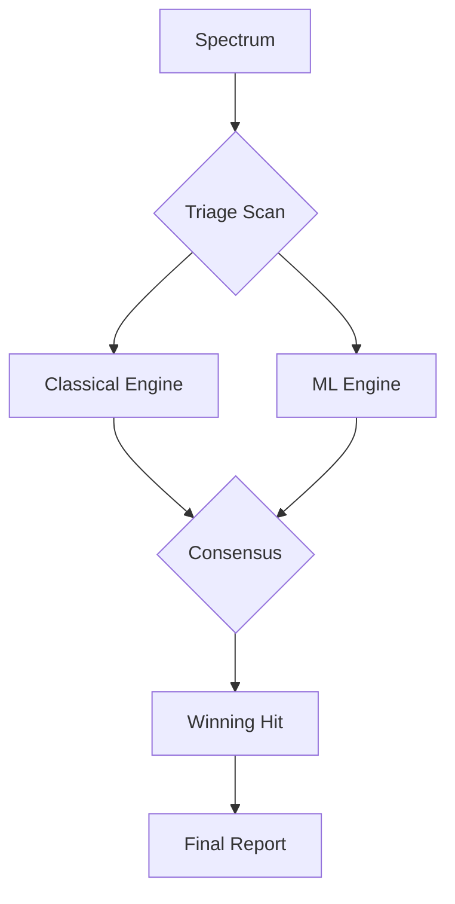

# Architecture Diagrams

This document contains simplified, high-level visual representations of the MassFlow system.

## 1. System Summary
This diagram shows the 10,000-foot view of MassFlow.

## 2. Core Data Flow (The Scientific Pipeline)
This sequence illustrates the clean-score-filter-export pipeline.

## 3. Multiprocessing & Performance
MassFlow uses parallel workers and shared memory to accelerate processing.

## 4. The Orchestrator API & Consensus
How the Orchestrator routes spectra to multiple engines and calculates a consensus.

