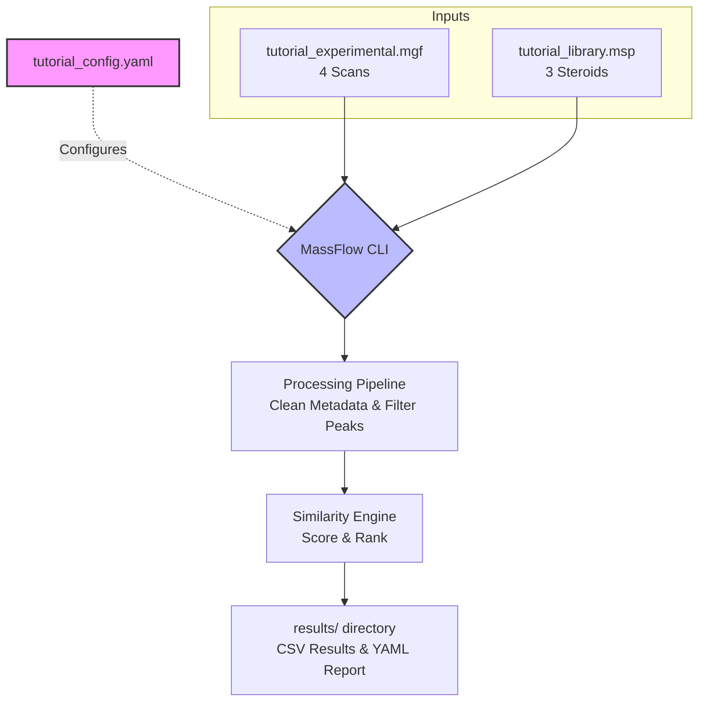
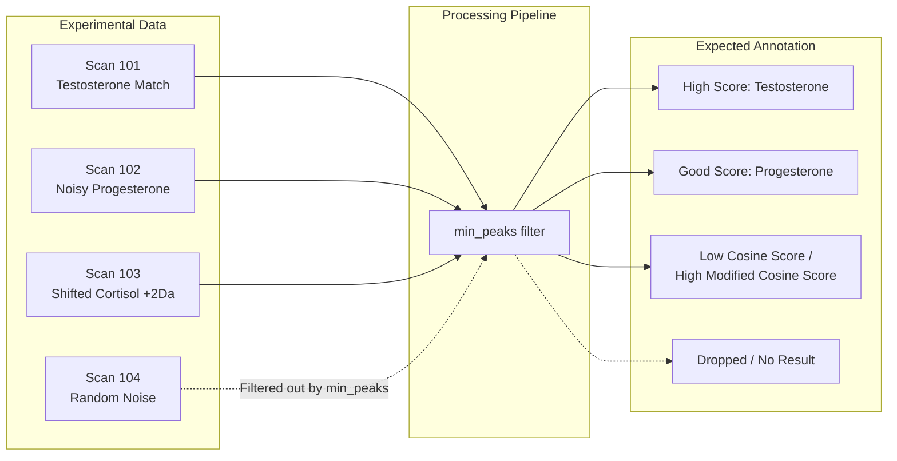
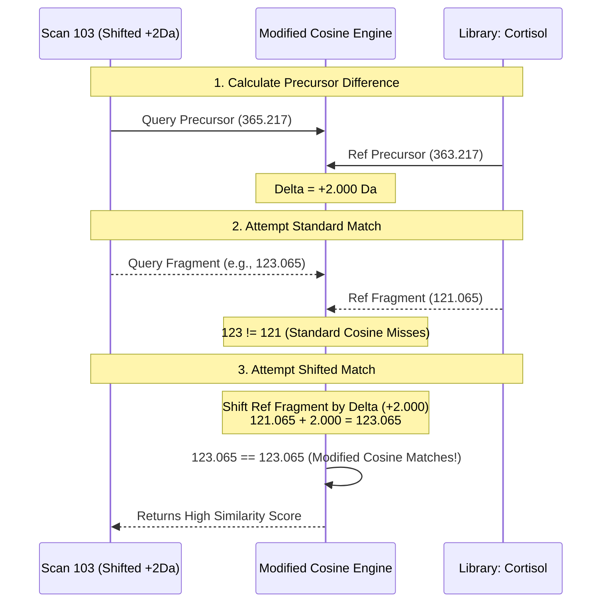

# MassFlow Tutorial: Steroid Annotation & Networking

This tutorial demonstrates how to use MassFlow to annotate experimental MS/MS spectra using a reference library of steroids. We will cover configuration, processing, and interpreting similarity results.

---

## 1. High-Level Workflow

The diagram below illustrates how inputs flow through the MassFlow pipeline:



---

## 2. Tutorial Dataset

The `/tutorial` folder contains:
- `tutorial_library.msp`: A reference library containing 3 steroids (Testosterone, Progesterone, and Cortisol) with standardized metadata (InChIKey, SMILES).
- `tutorial_experimental.mgf`: Simulated experimental data with 4 scans.

Here is what MassFlow will do with each scan:



---

## 3. Configuration Walkthrough

Open `tutorial/tutorial_config.yaml`. The key sections are:

### Input
Points to our tutorial files:
```yaml
input:
  file_path: "tutorial/tutorial_experimental.mgf"
  library_path: "tutorial/tutorial_library.msp"
```

### Processing
Ensures spectra are cleaned and normalized before scoring:
```yaml
processing:
  clean_metadata: true
  normalize_intensity: true
  filter_min_peaks: true
  min_peaks: 3
```

### Similarity
Uses the standard `cosine` algorithm. We've set `min_score: 0.1` very low for this tutorial to ensure we see the scores for all candidates.
```yaml
similarity:
  algorithm: "cosine"
  ms1_tolerance: 0.02
  ms2_tolerance: 0.02
  tolerance_unit: "Da"
```

---

## 4. Running the Analysis

Execute the annotation workflow from the project root:

```bash
uv run massflow annotate --config tutorial/tutorial_config.yaml
```

Check the `tutorial/results/` directory after running.

### Annotation Report (`tutorial_experimental_results.csv`)
- **Scan 101** should show a high score (>0.9) against Testosterone.
- **Scan 102** should show a high score against Progesterone.
- **Scan 103** (Modified Cortisol) will likely have a **low** score with standard `cosine` because the peaks are shifted.

---

## 5. Experimenting with Molecular Networking (Modified Cosine)

To find related molecules like the shifted Cortisol in **Scan 103**, we need an algorithm that forgives consistent mass shifts. Change the algorithm in `tutorial_config.yaml` to `modified_cosine`:

```yaml
similarity:
  algorithm: "modified_cosine"
```

Run the annotation again. You will notice that the score for Scan 103 against Cortisol increases significantly.

### How Modified Cosine Works

The diagram below shows why standard cosine fails on Scan 103 and why modified cosine succeeds:



## 6. Summary
This small dataset showcases:
1. **Spectral Matching**: High-confidence identification of knowns.
2. **Noise Resilience**: Filtering out low-quality scans.
3. **Modified Cosine**: Identifying structurally related molecules with mass offsets, which is the foundation of molecular networking.
